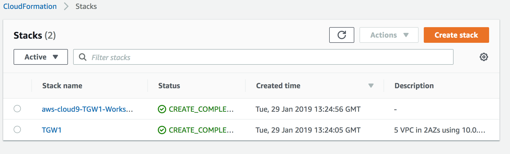

# 1. Transit Gateway Lab setup

Using a predefined CloudFormation template, we will deploy a Simulated Datacenter in a VPC, as well as several VPC for our Non-production, Production, and Shared Services environments.

## Getting Started

First, we need to get our infrastructure in place. The following CloudFormation template will build out _five_ VPCs. In order to do that we will first remove the default VPC. \*note: if you ever remove you default VPC in your own account, you can recreate it via the console or the CLI see the [documentation](https://docs.aws.amazon.com/vpc/latest/userguide/default-vpc.html#create-default-vpc "AWS Default VPC Documentation").

### Pick Region

Since we will be deploying Cloud9 into our Datacenter VPC, we need to pick one of the following Regions:

- N. Virginia (us-east-1)
- Ohio (us-east-2)
- Oregon (us-west-2)
- Ireland (eu-west-1)
- Singapore (ap-southeast-1)

### 1. Delete Default VPC

A default VPC is automatically created for each region in your account. Some customers choose to remove the Default VPC and replace with ones they have planned out to keep things simple and secure. We are going to remove the default VPC for another reason: the number of VPCs per region in an account is soft limited to 5 and our Lab uses five VPCs. If you require more than five in your own accounts, its easy to increase them by making a limit request through the support console, while logged into your account: https://console.aws.amazon.com/support/cases#/create.

HOW TO Delete Default VPC

1. In the AWS Management Console change to the region you plan to work in and change. This is in the upper right hand drop down menu.

1. In the AWS Management Console choose **Services** then select **VPC**.

1. From the left-hand menu select **Your VPCs**.

1. In the main panel, the checkbox next to only VPC (the default VPC) should be highlighted. You can verify this is the Default VPC by scrolling to the right. The _Default VPC_ column will be maked with **Yes**.

1. With our Default VPC checked select the **Actions** dropdown above it and select **Delete VPC**.

1. In the _Delete VPC_ Panel, check the box 'I Acknowledge that I want to delete my default VPC.' and click the **Delete VPC** button in the bottom right.

1. You should get a green highlighted Dialog stating 'The VPC was deleted' and you can click **Close**. _If it is red, then likely something is deployed into this VPC and you will have to remove those resources (could be EC2 instances, NAT Gateway, VPC endpoints, etc). You could also consider another region from the list above._

### 2. Deploy Our Five VPCs

Run CloudFormation template 1.tgw-vpcs.yaml to deploy the VPCs.

HOW TO Deploy the VPCs

1. In the AWS Management Console change to the region you are working in. This is in the upper right hand drop down menu.

1. In the AWS Management Console choose **Services** then select **CloudFormation**.

1. In the main panel select **Create Stack** in the upper right hand corner.

   

1. Make sure **Template is ready** is selected from Prepare template options.

1. At the **Prerequisite - Prepare template** screen, for **template source** select **Upload a template file** and click **Choose file** from **Upload a Template file**. from your local files select **1.tgw-vpcs.yaml** and click **Open**.

1. Back at the **Prerequisite - Prepare template** screen, click **Next** in the lower right.

1. For the **Specify stack details** give the stack a name (be sure to record this, as you will need it later) and Select two Availability Zones (AZs) to deploy to. \*We will be deploying all of the VPCs in the same AZs, but that is not required. Click **Next**.
   

1. For **Configuration stack options** we dont need to change anything, so just click **Next** in the bottom right.

1. Scroll down to the bottom of the **Review name_of_your_stack** and check the **I acknowledge that AWS CloudFormation might create IAM resources with custom names.** Click the **Create** button in the lower right.
   

1. wait for the Stack to show **Create_Complete**.
   

      

      

Investigate the VPCs

- Add steps to take a look at the Subnets, route tables, etc.
- Add steps for using session manager to access an EC2 instance. Talk about no Bastion etc.

# Congratulations

You now have **completed** this section. Continue to the [Setup Transit Gateway and VPN module](../2.singleaccount) , to setup communication between VPCs and the Datacenter.
