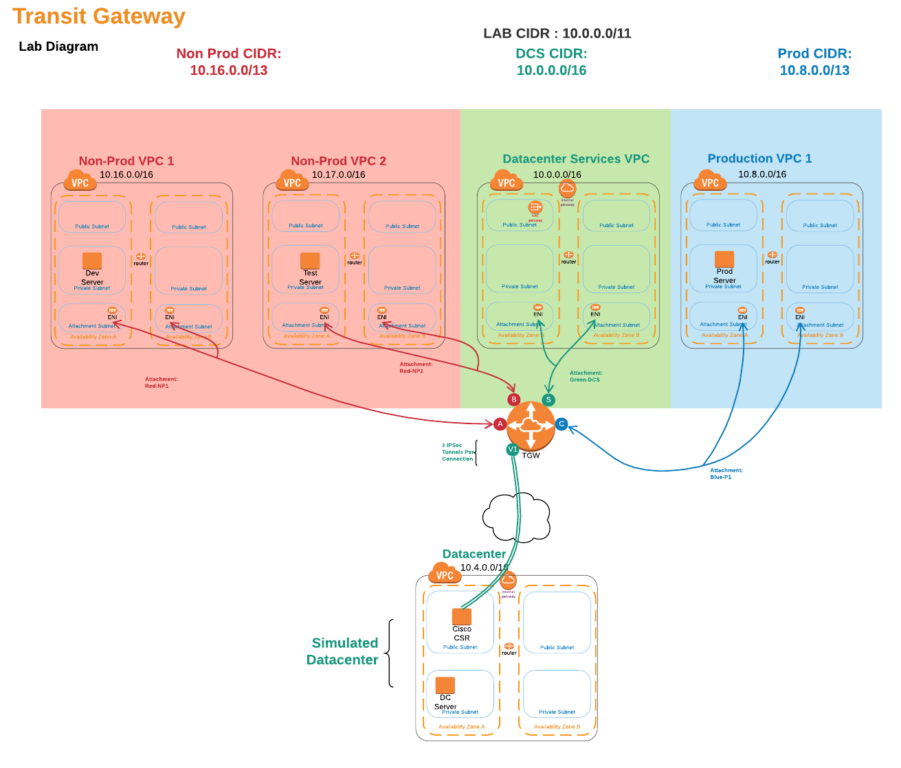
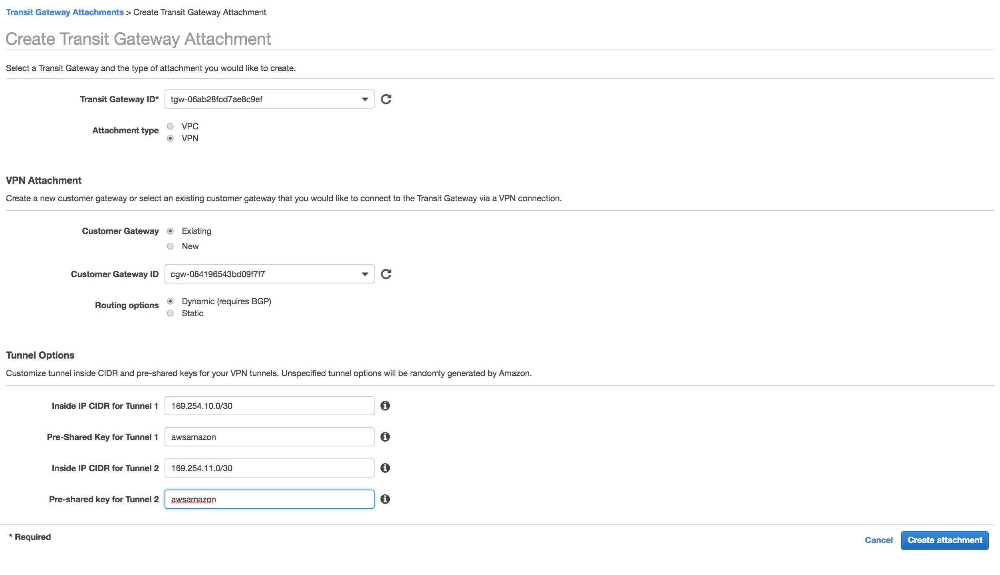
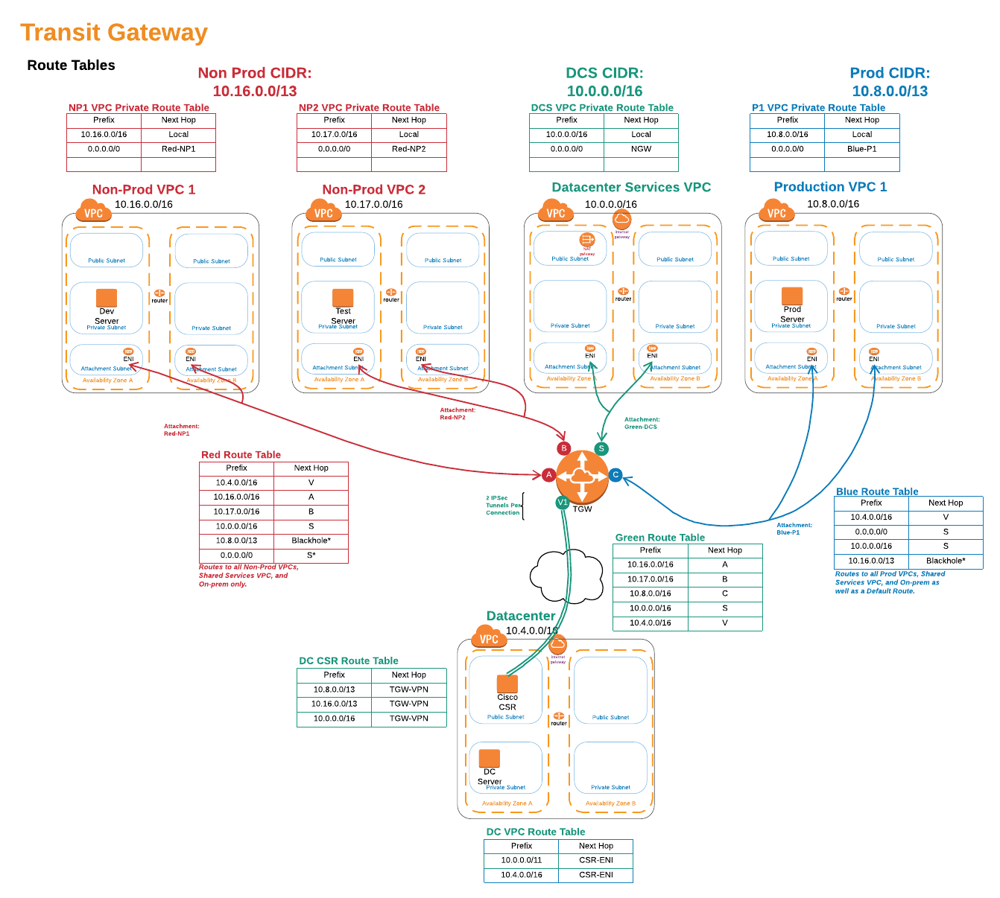

# 2. Transit Gateway Setup and VPN to Datacenter

Using a predefined CloudFormation template, we will deploy a Simulated Datacenter in a VPC, as well as several VPC for our Non-production, Production, and Shared Services environments.



### 1. Create Transit Gateway and Datacenter Router

We now are ready to start our connectivity and routing policy.
Run CloudFormation template 2.tgw-csr.yaml to deploy the Transit Gateway, route Tables, and the Datacenter Router (Cisco CSR).

<details>
<summary>HOW TO Deploy the Transit Gateway and Datacenter Router</summary><p>

1. In the AWS Management Console change to the region you are working in. This is in the upper right hand drop down menu.

1. In the AWS Management Console choose **Services** then select **EC2**.

1. From the left-hand menu select **Key Pairs**.

1. Click **Create Key Pair** in the main panel and give your new key a name. Click **Create**.

1. Save the keypair to your local machine for easy access later. \*note: We will need this key to access the Cisco CSR router that is in our Simulated Datacenter VPC\*\*.

1. In the AWS Management Console choose **Services** then select **CloudFormation**.

1. In the main panel select **Create Stack** in the upper right hand corner.<p>
   

1. Make sure **Template is ready** is selected from Prepare template options.

1. At the **Prerequisite - Prepare template** screen, for **template source** select **Upload a template file** and click **Choose file** from **Upload a Template file**. from your local files select **2.tgw-csr.yaml** and click **Open**.

1. Back at the **Prerequisite - Prepare template** screen, clcik **Next** in the lower right.

1. For the **Specify stack details** give the stack a name (compounded names work well. i.e. if the VPC stack above was named **TGW1** name this stack **TGW1-CSR**), pick the keypair you created earlier, and enter the name of your first stack (must be entered exactly to work). Click **Next**.
   

1. For **Configuration stack options** we dont need to change anything, so just click **Next** in the bottom right.

1. Scroll down to the bottom of the **Review name_of_your_stack** and check the **I acknowledge the AWS CloudFormation might create IAM resources with custom names.** Click the **Create** button in the lower right.
   

1. wait for the Stack to show **Create_Complete**.
   

      </p>
      </details>

<details>
<summary>Access AWS Cloud9 Environment </summary><p>
- Add steps to take a look at the TGW, TGW route tables, TGW attachments.
- Add steps for accessing Cloud9.
1. In the AWS Management Console change to the region you are working in. This is in the upper right hand drop down menu.

1. In the AWS Management Console choose **Services** then select **Cloud9**.

1.From **Your Environments** page click the \*_Open IDE_ button on the Workshop Environment Box.


1. This will bring up the Cloud9 Console and download the github repo to your working folder.

1. From the **file** menu select **Upload Local Files...** and click **Select files** button, navigate to the key file you created earlier. _note: it should have a .pem extension_.
   

1. In the main panel click the + sign and launch a **New Terminal**. This is a bash shell on the Cloud9 Instance

1. move the key to the .ssh folder: mv _key_name_.pem ~/.ssh/.

1. secure the key file: chmod 400 ~/.ssh/_key_name_.pem

1.From another browser tab, again navigate to the Management Console and choose **Services** then select **CloudFormation**.

1. From the EC2 Dashboard, select **Exports** in the left hand menu and find the export for ssh to the CSR: DC1-_stack-name_-CSR-VPC and copy the **Export value**
   

1. Back on the **Cloud9** Browser tab paste this into the bash shell. _note: in the command you will notice the -i reference to the pem file you just copied, this is the private half of the key pair. The public key is on the Cisco CSR_. Answer **yes** to the \*\*Are you sure you want to continue connecting (yes/no)?

1. you now are connected to the Cisco CSR in the Datacenter VPC. We will be configuring the Cisco CSR.

1. Lets look at the Interfaces by typing a the #prompt: **show ip interface brief** or **sh ip int br** for short. You will see the GigabitEhternet1 which is the interface our ipsec tunnel were traverse.

1. Take a look at the route table on the CSR by typing at the #prompt: **sh ip route**. You will see S\* 0.0.0.0/0 which is a static default route pointing to the 10.4.0.1 address. This is the local VPC router which will connect the Interface to the Internet Gateway and use an Elastic IP address (its the IP address you used in the SSH command above). This is a one-to-one mapping.

</p>
</details>

<details>
<summary>Setup VPN Between Datacenter and Transit Gateway</summary><p>
Ipsec tunnels can be setup over the internet or over Direct Connect (using a Public Virtual Interface). In this case we are connecting over the public backbone of AWS.
We will create two VPN tunnels from the Transit Gateway and connect them into a single instance of the Cisco CSR in the Datacenter. 
In a real production environment we would setup a second router for redundancy and for added bandwidth setup multiple tunnels from each Cisco CSR (or whichever ipsec device you use). Each ipsec tunnel provides up to 1.25Gbps. This is called Equal cost multipath routing. On the AWS side, up to 50 parallel paths are supported. Many vendors support 4-8 ECMP paths, so check with your vendor)

1. In the AWS Management Console change to the region you are working in. This is in the upper right hand drop down menu.

1. In the AWS Management Console choose **Services** then select **VPC**.

1. From the menu on the left, Scroll down and select **Transit Gateway Attachments**.

1. You will see the VPC Attachments listed, but we want to add one to connect our Datacenter. Click the **Create Transit Gateway Attachment** button above the list.

1. Fill out the **Create Transit Gateway Attachment** form.

- **Transit Gateway ID** will have a name Tag matching your first CloudFormation Stack name.
- **Attachment Type** is **VPN**
- **Customer Gateway** (CGW) will be **Existing**. _note: the CloudFormation template created the CGW. it is the IP address of our Datacenter VPN device and in the lab matches the IP of the SSH command above._
- Leave **Routing options** set to **Dynamic(requires BGP)**. _note: BGP is required if you want traffic to balance across more than one VPN tunnel at a time (ECMP or Equal Cost Multipathing)_
- For **Inside IP CIDR for Tunnel 1** use **169.254.10.0/30** for CIDR.

- For **Pre-Shared Key for Tunnel 1** use **awsamazon**
- For **Inside IP CIDR for Tunnel 2** use **169.254.10.0/30**for CIDR.
- For **Pre-Shared Key for Tunnel 2** use **awsamazon**
- Once the page is filled out, click **Create attachment** at the bottom right.
  

1.  While we are on the **Transit Gateway Attachments** page, lets go back to the top and give the VPN connection a name. Scan down the **Resource type** column for the VPN Attachment. \*note: you may have to hit the refresh icon in the upper right above the table to get the new VPN to show. If you click the pencil that appears when you mouse over the **Name** column, you can enter a name. Be sure to click the _check_ mark to save the name.

1.  From the Menu on the Left Select **Site-to-Site VPN Connections**. From the main panel, you likely will see the VPN is in State **pending**. That fine. Lets take a look toward the bottom, and click the **Tunnel Details** tab. Record the two **Outside IP Address**es. We want to record them in the order of the one pairing up with the **Inside IP CIDR** range 169.254.**10**.0/30 first. _note: You can use cloud9 as a scratch pad, by clicking the + in the main panel and selecting **New file**. be sure to paste them in the right order!_

1.  From the Menu on the Left Select **Transit Gateway Route Tables**. From the table in the main panel select **Green Route Table**. Lets take a look toward the bottom, and click the **Associations** tab. Associations mean that traffic coming from the outside toward the Transit gateway will use this route table to know where the packet will go after routing through the TGW. _note: An attachment can only be Associated with one route table. But a route table can have multiple associations_. Here in the **Green Route Table**, We already have one association, The **Datacenter Services VPC**. Click **Create associations** in the **Associations** tab. From the drop-down list, select the vpn. _note:it should be the only one in the list without a **Association route table** ._ Click **Create association**.
    

1.  While at the **Transit Gateway Route Tables**, take a look at the **Propagations** tab. These are the Resources that Dynamically inform the route table. An attachment can propagate to multiple route tables. For the Datacenter, we want to propagate to all of the route tables so the VPC associated with each route table can route back to the datacenter. Lets start with the **Green Route Table**. We can see all of the VPCs are propagating their CIDR to the route table. Since the **Datacenter Services VPC** is also associated with this route table, we need to propagate the VPN routes to the **Green Route Table**.

1.  Repeat the above step on the propagations tab for the **Red Route Table** and the **Blue Route Table**.

1.  Take a look at each of the route tables and notice the tab **Routes**. You can see the routes that are propagated, as well as a static route table that was created for you by the CloudFormation template. That's the default route (0.0.0.0/0) that will direct traffic destined for the internet to the **Datacenter Services VPC** and ultimately through the NAT Gateway in that VPC. _note: there is also a route table with no name. This is the default route table. In this lab we do not intend to use the default route table_.

1.  Back on the Cloud9 browser tab, using the two VPN tunnel endpoint address generated from the step above, cd to tgwwalk on the Cloud9 bash console and run the bash script, ./createcsr.sh. _note: Be sure to put the address that lines up with Inside IP CIDR address 169.254.10.0/30 for ip1_.
    Example from Site-to-Site VPN
    

    ```
    cd tgwwalk
    ##./createcsr.sh ip1 ip2 outputfile
    ./createcsr.sh 35.166.118.167 52.36.14.223 mycsrconfig.txt
    ```

    _note: AWS generates starter templates to assist with the configuration for the on-prem router. For your real world deployments, you can get a starter template from the console for various devices (Cisco, Juniper, Palo Alto, F5, Checkpoint, etc). Word of Caution is to look closely at the routing policy in the BGP section. you may not want to send a default route out. You likely also want to consider using a route filter to prevent certain routes from being propagated to you._

1.  On the left hand panel, the output file should be listed. You may have to open the tgwwalk folder to see the txt file. Select all text (ctrl-a on pc/command-a on mac). Then copy the text to buffer (Select all text (ctrl-c on pc/command-c on mac))

1.  enter configuration mode, which will take you to a config prompt

    ```
    ip-10-4-0-17#conf t
    Enter configuration commands, one per line.  End with CNTL/Z.
    ip-10-4-0-17(config)#
    ```

1.  Once in Configuration mode _note: you should see (config)# prompt_, paste Select all text (ctrl-v on pc/command-v on mac) in the text from the outputfile created in step 4. This will slowly paste in the configuration file.

1.  if you are still at the (config)# or (config-router) prompt, type **end** and press enter.

1.  Now lets look at the new interfaces: **sh ip int br**. You should see new interfaces: Tunnel1 and Tunnel2 and they both should show up. \*note: if they do not change from down to up after a 2 minutes, likely cause is the ip addresses were flipped in the createcsr script.
    

1.  Lets make sure we are seeing the routes on the Cisco CSR. first we can look at what BGP is seeing: **show ip bgp summary**. The most important thing to see is the State/PfxRcd (Prefixes received). If this is in Active or Idle (likely if neighbor statement is wrong: IP address, AS number) there is a configuration issue. What we want to see is a number. In fact if everything is setup correctly we should see 4 for each neighbor.

    ```
    ip-10-4-0-17#sh ip bgp summ
    BGP router identifier 169.254.10.2, local AS number 65001
    BGP table version is 6, main routing table version 6
    5 network entries using 1240 bytes of memory
    9 path entries using 1224 bytes of memory
    2/2 BGP path/bestpath attribute entries using 560 bytes of memory
    1 BGP AS-PATH entries using 24 bytes of memory
    0 BGP route-map cache entries using 0 bytes of memory
    0 BGP filter-list cache entries using 0 bytes of memory
    BGP using 3048 total bytes of memory
    BGP activity 5/0 prefixes, 9/0 paths, scan interval 60 secs

    Neighbor        V           AS MsgRcvd MsgSent   TblVer  InQ OutQ Up/Down  State/PfxRcd
    169.254.10.1    4        65000      40      43        6    0    0 00:06:03        4
    169.254.11.1    4        65000      40      44        6    0    0 00:06:04        4
    ip-10-4-0-17#
    ```

1.  We can also see what those routes are and how many paths we have with the **show ip routes** or **sh ip ro** command.

    ```
    ...<output omitted>
    Gateway of last resort is 10.4.0.1 to network 0.0.0.0

    S*    0.0.0.0/0 [1/0] via 10.4.0.1, GigabitEthernet1
          10.0.0.0/8 is variably subnetted, 7 subnets, 3 masks
    B        10.0.0.0/16 [20/100] via 169.254.11.1, 00:00:04
    S        10.4.0.0/16 is directly connected, GigabitEthernet1
    C        10.4.0.0/22 is directly connected, GigabitEthernet1
    L        10.4.0.17/32 is directly connected, GigabitEthernet1
    B        10.8.0.0/16 [20/100] via 169.254.11.1, 00:00:04
    B        10.16.0.0/16 [20/100] via 169.254.11.1, 00:00:04
    B        10.17.0.0/16 [20/100] via 169.254.11.1, 00:00:04
          169.254.0.0/16 is variably subnetted, 4 subnets, 2 masks
    C        169.254.10.0/30 is directly connected, Tunnel1
    L        169.254.10.2/32 is directly connected, Tunnel1
    C        169.254.11.0/30 is directly connected, Tunnel2
    L        169.254.11.2/32 is directly connected, Tunnel2
    ip-10-4-0-17#
    ```

1.  Notice that there is only one next-hop address for each of the VPCs CIDRs. We can fix this by allow Equal Cost Multipathing (ECMP).
    Back in config mode we will add maximum-paths to 8:
    `ip-10-4-0-17# config t router bgp 65001 address-family-ipv4 maximum-paths 8 end`
    Now, run **sh ip ro** command again. See, both the tunnels are showing up!

          ```
          ...<output omitted>
          Gateway of last resort is 10.4.0.1 to network 0.0.0.0

          S*    0.0.0.0/0 [1/0] via 10.4.0.1, GigabitEthernet1
                10.0.0.0/8 is variably subnetted, 7 subnets, 3 masks
          B        10.0.0.0/16 [20/100] via 169.254.11.1, 00:00:13
                            [20/100] via 169.254.10.1, 00:00:13
          S        10.4.0.0/16 is directly connected, GigabitEthernet1
          C        10.4.0.0/22 is directly connected, GigabitEthernet1
          L        10.4.0.17/32 is directly connected, GigabitEthernet1
          B        10.8.0.0/16 [20/100] via 169.254.11.1, 00:00:13
                            [20/100] via 169.254.10.1, 00:00:13
          B        10.16.0.0/16 [20/100] via 169.254.11.1, 00:00:13
                            [20/100] via 169.254.10.1, 00:00:13
          B        10.17.0.0/16 [20/100] via 169.254.11.1, 00:00:13
                            [20/100] via 169.254.10.1, 00:00:13
                169.254.0.0/16 is variably subnetted, 4 subnets, 2 masks
          C        169.254.10.0/30 is directly connected, Tunnel1
          L        169.254.10.2/32 is directly connected, Tunnel1
          C        169.254.11.0/30 is directly connected, Tunnel2
          L        169.254.11.2/32 is directly connected, Tunnel2
          ip-10-4-0-17#
          ```

1.  Just to verify where those routes are coming from, we can take a look at the **Green Route Table**. _note: remember, it's under the **VPC** service and **Transit Gateway Route Tables** at the bottom of the left menu._ There should be **5** routes listed. Any ideas why only **4** show up on the CSR?

</p>
</details>

### Extra: Create 2 more Equal Cost Paths to the Datacenter

Bandwidth scaling and High Availability are built into the Transit Gateway inherently as well via the multiple Availability ZOne (AZ) attachments to our VPCs. However; for connectivity back to our Datacenter, we have some things to consider. In the real world, we would create another customer gateway on a totally separate physical device. Ideally this is physically as fault-isolated from the first Customer Gateway as we can make it (think, in across the room or even in another communications room. With separate connectivity and power if we have it). But in order to distribute load across both Customer gateways from the datacenter, you typically would use another tier of routers (shown below via a core router) to balance the traffic. For our demo purposes, lets build it on the same CSR we have in our simulated Datacenter so we can see ECMP in action.


   <details>
   <summary>Creating Four Equal Cost paths between our VPCs and the Datacenter</summary><p>

1. In the AWS Management Console change to the region you are working in. This is in the upper right hand drop down menu.

1. In the AWS Management Console choose **Services** then select **VPC**.

1. From the menu on the left, Scroll down and select **Transit Gateway Attachments**.

1. You will see the VPC Attachments listed, but we want to add one to connect our Datacenter. Click the **Create Transit Gateway Attachment** button above the list.

1. Fill out the **Create Transit Gateway Attachment** form.

- **Transit Gateway ID** will have a name Tag matching your first CloudFormation Stack name.
- **Attachment Type** is **VPN**
- **Customer Gateway** (CGW) will be **Existing**. _note: the CloudFormation template created the CGW. it is the same IP address used in the previous VPN._
- Leave **Routing options** set to **Dynamic(requires BGP)**. _note: BGP is required if you want traffic to balance across more than one VPN tunnel at a time (ECMP or Equal Cost Multipathing)_
- For **Inside IP CIDR for Tunnel 1** use **169.254.12.0/30** for CIDR. _Note: we are different addresses from the previous VPN_

- For **Pre-Shared Key for Tunnel 1** use **awsamazon**
- For **Inside IP CIDR for Tunnel 2** use **169.254.12.0/30** for CIDR. _Note: we are different addresses from the previous VPN_
- For **Pre-Shared Key for Tunnel 2** use **awsamazon**
- Once the page is filled out, click **Create attachment** at the bottom right.
  

1.  While we are on the **Transit Gateway Attachments** page, lets go back to the top and give the VPN connection a name. Scan down the **Resource type** column for the VPN Attachment. \*note: you may have to hit the refresh icon in the upper right above the table to get the new VPN to show. If you click the pencil that appears when you mouse over the **Name** column, you can enter a name that's different than the first VPN. Be sure to click the _check_ mark to save the name.

1.  From the Menu on the Left Select **Site-to-Site VPN Connections**. From the main panel, you likely will see the new VPN is in State **pending**. That fine. Lets take a look toward the bottom, and click the **Tunnel Details** tab. Record the two **Outside IP Address**es. We want to record them in the order of the one pairing up with the **Inside IP CIDR** range 169.254.**12**.0/30 first. _note: You can use cloud9 as a sratch pad, by clicking the + in the main panel and selecting **New file**. be sure to paste them in the right order!_

1.  From the Menu on the Left Select **Transit Gateway Route Tables**. From the table in the main panel select **Green Route Table**. Lets take a look toward the bottom, and click the **Associations** tab. Associations mean that traffic coming from the outside toward the Transit gateway will use this route table to know where the packet will go after routing through the TGW. _note: An attachment can only be Associated with one route table. But a route table can have multiple associations_. Here in the **Green Route Table**, We already have one association, The **Datacenter Services VPC**. Click **Create associations** in the **Associations** tab. From the drop-down list, select the vpn. _note:it should be the only one in the list without a **Association route table** ._ Click **Create association**.
    

1.  While at the **Transit Gateway Route Tables**, take a look at the **Propagations** tab. These are the Resources that Dynamically inform the route table. An attachment can propagate to multiple route tables. For the Datacenter, we want to propagate to all of the route tables so the VPC associated with each route table can route back to the datacenter. Lets start with the **Green Route Table**. We can see all of the VPCs are propagating their CIDR to the route table. Since the **Datacenter Services VPC** is also associated with this route table, we need to propagate the VPN routes to the **Green Route Table**.

1.  Repeat the above step on the propagations tab for the **Red Route Table** and the **Blue Route Table**.

1.  Take a look at each of the route tables and notice the tab **Routes**. You can see the routes that are propagated, as well as a static route table that was created for you by the CloudFormation template. That's the default route (0.0.0.0/0) that will direct traffic destined for the internet to the **Datacenter Services VPC** and ultimately through the NAT Gateway in that VPC. _note: there is also a route table with no name. This is the default route table. In this lab we do not intend to use the default route table_.

1.  Back on the Cloud9 browser tab, using the two VPN tunnel endpoint address generated from the step above, cd to tgwwalk on the Cloud9 bash console and run the bash script, ./create2ndcsr.sh. _note: THIS is a different Script than above! Also, be sure to put the address that lines up with Inside IP CIDR address 169.254.12.0/30 for ip1_.
    Example from Site-to-Site VPN
    

    ```
    cd tgwwalk
    ##./create2ndcsr.sh ip1 ip2 outputfile
    ./create2ndcsr.sh 35.166.118.167 52.36.14.223 my2ndcsrconfig.txt
    ```

    _note: AWS generates starter templates to assist with the configuration for the on-prem router. For your real world deployments, you can get a starter template from the console for various devices (Cisco, Juniper, Palo Alto, F5, Checkpoint, etc). Word of Caution is to look closely at the routing policy in the BGP section. you may not want to send a default route out. You likely also want to consider using a route filter to prevent certain routes from being propagated to you._

1.  On the left hand panel, the output file should be listed. You may have to open the tgwwalk folder to see the txt file. Select all text (ctrl-a on pc/command-a on mac). Then copy the text to buffer (Select all text (ctrl-c on pc/command-c on mac))

1.  enter configuration mode, which will take you to a config prompt

    ```
    ip-10-4-0-17#conf t
    Enter configuration commands, one per line.  End with CNTL/Z.
    ip-10-4-0-17(config)#
    ```

1.  Once in Configuration mode _note: you should see (config)# prompt_, paste Select all text (ctrl-v on pc/command-v on mac) in the text from the outputfile created in step 4. This will slowly paste in the configuration file.

1.  if you are still at the (config)# or (config-router) prompt, type **end** and press enter.

1.  Now lets look at the new interfaces: **sh ip int br**. You should see new interfaces: Tunnel1 and Tunnel2 and they both should show up. \*note: if they do not change from down to up after a 2 minutes, likely cause is the ip addresses were flipped in the createcsr script.
    

1.  Lets make sure we are seeing the routes on the Cisco CSR. first we can look at what BGP is seeing: **show ip bgp summary**. The most important thing to see is the State/PfxRcd (Prefixes received). If this is in Active or Idle (likely if neighbor statement is wrong: IP address, AS number) there is a configuration issue. What we want to see is a number. In fact if everything is setup correctly we should see 4 for each neighbor.

    ```
    ip-10-4-2-30#sh ip bgp summ
    BGP router identifier 169.254.10.2, local AS number 65001
    BGP table version is 68, main routing table version 68
    5 network entries using 1240 bytes of memory
    17 path entries using 2312 bytes of memory
    4 multipath network entries and 16 multipath paths
    2/2 BGP path/bestpath attribute entries using 560 bytes of memory
    1 BGP AS-PATH entries using 24 bytes of memory
    0 BGP route-map cache entries using 0 bytes of memory
    0 BGP filter-list cache entries using 0 bytes of memory
    BGP using 4136 total bytes of memory
    BGP activity 14/9 prefixes, 40/23 paths, scan interval 60 secs

    Neighbor        V           AS MsgRcvd MsgSent   TblVer  InQ OutQ Up/Down  State/PfxRcd
    169.254.10.1    4        65000     368     391       68    0    0 01:00:41        4
    169.254.11.1    4        65000     367     387       68    0    0 01:00:40        4
    169.254.12.1    4        65000     374     394       68    0    0 01:01:44        4
    169.254.13.1    4        65000     373     392       68    0    0 01:01:39        4
    ```

1.  Lets verify Equal Cost Multipathing (ECMP). Making sure we setup ECMP, back in config mode we will add maximum-paths to 8:
    `ip-10-4-0-17# config t router bgp 65001 address-family-ipv4 maximum-paths 8 end`
    Now, run **sh ip ro** command . See, both the tunnels are showing up!

    ```
    ...<output omitted>
    S*    0.0.0.0/0 [1/0] via 10.4.0.1, GigabitEthernet1
          10.0.0.0/8 is variably subnetted, 7 subnets, 3 masks
    B        10.0.0.0/16 [20/100] via 169.254.13.1, 01:01:05
                      [20/100] via 169.254.12.1, 01:01:05
                      [20/100] via 169.254.11.1, 01:01:05
                      [20/100] via 169.254.10.1, 01:01:05
    S        10.4.0.0/16 is directly connected, GigabitEthernet1
    C        10.4.0.0/22 is directly connected, GigabitEthernet1
    L        10.4.2.30/32 is directly connected, GigabitEthernet1
    B        10.8.0.0/16 [20/100] via 169.254.13.1, 01:01:05
                      [20/100] via 169.254.12.1, 01:01:05
                      [20/100] via 169.254.11.1, 01:01:05
                      [20/100] via 169.254.10.1, 01:01:05
    B        10.16.0.0/16 [20/100] via 169.254.13.1, 01:01:05
                      [20/100] via 169.254.12.1, 01:01:05
                      [20/100] via 169.254.11.1, 01:01:05
                      [20/100] via 169.254.10.1, 01:01:05
    B        10.17.0.0/16 [20/100] via 169.254.13.1, 01:01:05
                      [20/100] via 169.254.12.1, 01:01:05
                      [20/100] via 169.254.11.1, 01:01:05
                      [20/100] via 169.254.10.1, 01:01:05
          169.254.0.0/16 is variably subnetted, 8 subnets, 2 masks
    C        169.254.10.0/30 is directly connected, Tunnel1
    L        169.254.10.2/32 is directly connected, Tunnel1
    C        169.254.11.0/30 is directly connected, Tunnel2
    L        169.254.11.2/32 is directly connected, Tunnel2
    C        169.254.12.0/30 is directly connected, Tunnel3
    L        169.254.12.2/32 is directly connected, Tunnel3
    C        169.254.13.0/30 is directly connected, Tunnel4
    L        169.254.13.2/32 is directly connected, Tunnel4
    ```

1.  Just to verify where those routes are coming from, we can take a look at the **Green Route Table**. _note: remember, it's under the **VPC** service and **Transit Gateway Route Tables** at the bottom of the left menu._

   </p>
   </details>

### Routing in the VPCs



   <details>
   <summary>Create Routes in the VPC to the Transit Gateway Attachments</summary><p>

While the CloudFormation Template created attachments to the VPCs and route tables for the transit gateway. We need to setup routing within the VPC. What traffic do we want going from each subnet to the Transit Gateway.

1. In the AWS Management Console change to the region you are working in. This is in the upper right hand drop down menu.

1. In the AWS Management Console choose **Services** then select **VPC**.

1. From the menu on the left, Scroll down and select **Route Tables**.

1. You will see the Route Tables listed in the main pane. Lets Start with NP1-_stack_name_-Private route table, Check the box next to it. Let take a look toward the bottom of the panel and click the **Routes** tab. Currently, there is just one route, the local VPC route. Since the only way out is going to be the Transit Gateway, lets make our life simple and point a default route to the Transit Gateway Attachment. Click the **Edit Routes** in the **Routes** tab.

1. On the **Edit routes** page, Click the **Add route** button and enter a default route by setting the destination of **0.0.0.0/0**. In the Target drop-down, select **Transit Gateway** and pick your Transit Gateway create for this project. It should be the only one.
   

1. Repeat the above step for the following route tables:

- NP2-_stack_name_-Private
- P1-_stack_name_-Private

1. For the **DCS1-_stack_name_-Public** and **DCS1-_stack_name_-Private** where our NAT Gateway is, we need a special route. We already have a default route pointed at the Internet Gateway(IGW) for the public and to the Nat Gateway(NGW) for the private to get to the internet, so we need a more specific entry to route internally. Lets use the rfc 1918 10.0.0.0/8 CIDR as that can only be internal and allows for future expansion without changes. Follow the steps above for both Route tables. Be sure not to alter the **0.0.0.0/0** route pointed to the IGW org NGW for these route tables.

1. Because the CloudFormation template setup a Security Group to allow ICMP traffic from 10.0.0.0/8, we should now be able to test pings from lots of place.

1. In the AWS Management Console choose **Services** then select **EC2**.

1. From the menu on the left, Scroll down and select **Instances**.

1. In the main pane, select an EC2 instance from the list and copy it ip address down. Repeat for as many as you would like to test connectivity. We want to test connectivity to the P1 server. Remember, we do not want our non prod instances to be able to reach our production servers or vice-versa.

- You can also get a list of IPs using the AWS CLI which you can run from the Cloud9 Instance. Here's one that extracts out all of them. The 10.16.x.x is the NP1, the 10.8.x.x is the P1 instance.

```
 aws ec2 describe-instances | grep "PrivateIpAddress" | cut -d '"' -f 4 | awk 'NR == 0 || NR % 4 == 0'
```

1. In the AWS Management Console choose **Services** then select **Systems Manager**. Systems Manager Gain Operational Insight and Take Action on AWS Resources. We are going to take a look a just one of seven capabilities of Systems Manager.

1. From the menu on the left, Scroll down and select **Session Manager**. Session Manager allows us to use IAM role and policies to determine who has console access without having to manage ssh keys for our instances.

1. In the main pane, click the **Start session** button. Pick an Instance to shell into. You will now enter a bash shell prompt for that instance.

1. Let Ping a server. Every one second or so, you should see a new line showing the reply and roundtrip time.

```
ping 10.16.18.220
sh-4.2$ ping 10.16.18.220
PING 10.16.18.220 (10.16.18.220) 56(84) bytes of data.
64 bytes from 10.16.18.220: icmp_seq=1 ttl=254 time=1.09 ms
64 bytes from 10.16.18.220: icmp_seq=2 ttl=254 time=0.763 ms
64 bytes from 10.16.18.220: icmp_seq=3 ttl=254 time=0.807 ms
64 bytes from 10.16.18.220: icmp_seq=4 ttl=254 time=0.891 ms
64 bytes from 10.16.18.220: icmp_seq=5 ttl=254 time=0.736 ms
64 bytes from 10.16.18.220: icmp_seq=6 ttl=254 time=0.673 ms
64 bytes from 10.16.18.220: icmp_seq=7 ttl=254 time=0.806 ms
^C
--- 10.16.18.220 ping statistics ---
7 packets transmitted, 7 received, 0% packet loss, time 6042ms
rtt min/avg/max/mdev = 0.673/0.824/1.096/0.130 ms
```

      Troubleshooting: if you are unable to ping a server here are a few things to check:
      - Go to the EC2 service and reverify the private IP address of the device you want to ping from
      - Go to the       VPC service and verify that you have the 0.0.0.0/0 route point to the TGW for VPCs NP1,NP2, and P1. Verify that you have the 10.0.0.0/8 route in the DCS VPC for both public and private subnets while you are here.
      - Finally, Verify that you went through the check for the TGW route tables propagation and the CSR is receiving routes (see the **Setup VPN Between Datacenter and Transit Gateway** section above)

1. You can also verify Internet access by using the curl command on the NP1, NP2 or P1 (the Datacenter Server wont use the Transit Gateway to get to the internet, but should still work). If you curl https://cloudformation.us-east-1.amazonaws.com it should return healthy.

1. If you tested between the P1 server and a NP1 or NP2 server, you should have also seen a reply ping. But that's not what we wanted. Look at the VPC route table and the Associated Transit Gateway Route table (_for P1 this should be Blue, for NP1 or NP2 this should be Red_) Follow the logic to understand what's going on.

 <details>
   <summary>SPOLIER Fixing Mysterious Prod to Non-Prod routing</summary><p>

      While we do not have a direct route between the Production and Non-Production VPCs we do have a gateway through the NAT Gateway in the **Datacenter Services VPC**. Let's fix this through a routing mechanism called Blackhole routing (sometimes referred to as null routing).

1. In the AWS Management Console choose **Services** then select **VPC**.

1. From the menu on the left, Scroll down and select **Transit Gateway Routes Tables**.

1. From the table in the main panel select **Blue Route Table**. Let's take a look toward the bottom, and click the **Routes** tab.

1. Take a look at the existing routes and see the 0.0.0.0/0 route that is sending data destined for the Non-prod address to the **Datacenter Services VPC**. Let's prevent that. Click the **Add route** button.

1. At the Create route screen, for the **CIDR** enter **10.16.0.0/13** and check the box next to **Blackhole**. This will drop any traffic destined for the Non-Production VPCs. This is because TGW looks for the most specific route that matches and the /13 is more specific than the /0 route.

   

1. Go back to Session Manager and connect to the P1 server and re-attempt to ping the NP1 or NP2 servers. Pings should fail now.

1. be sure to repeat the blackhole route in the **Red Route Table** by creating a blackhole route for 10.8.0.0/13.

   </p>
   </details>

</p>
</details>

# Congratulations

You now have **completed** this section. Continue to the [Setup DNS communication between the Datacenter and the VPCs](../3.dns) to setup DNS between your Datacenter and the Cloud.
