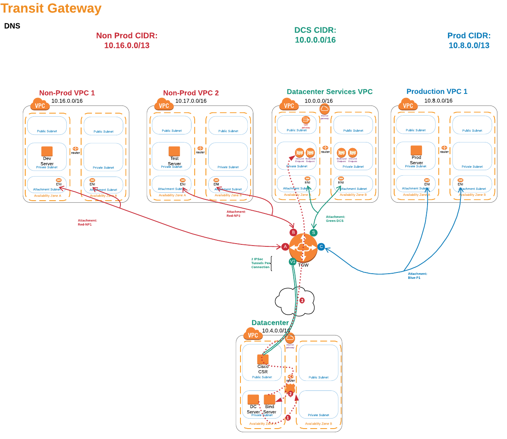
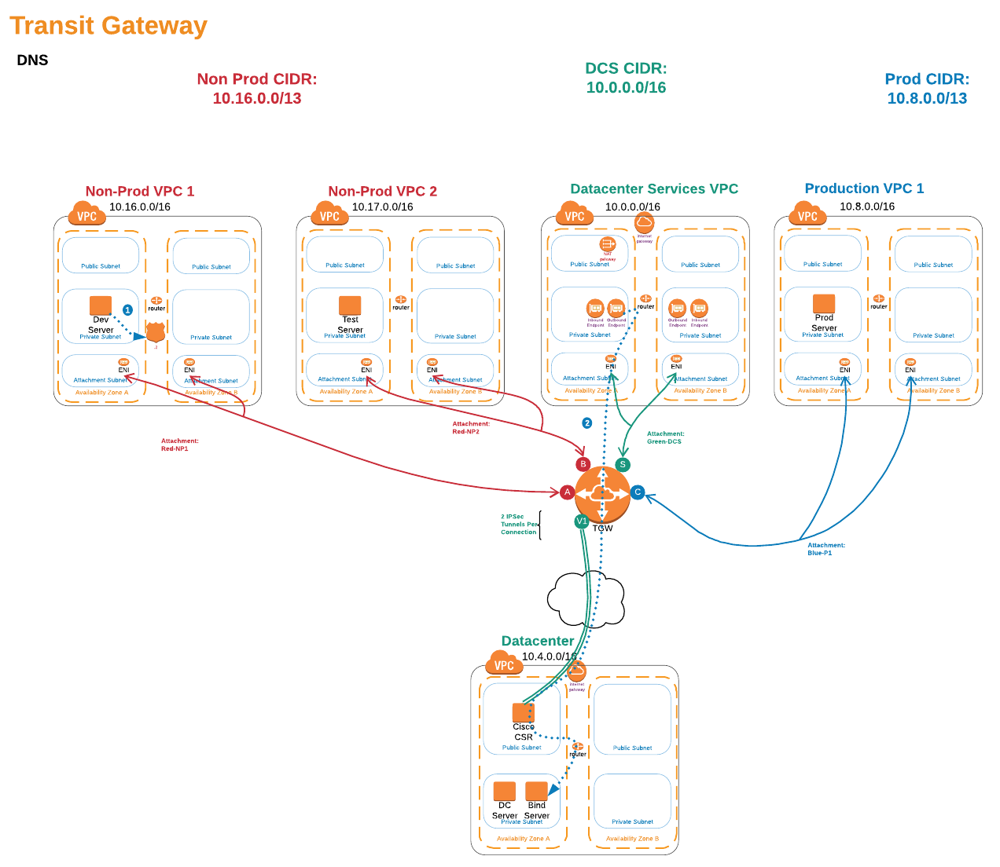
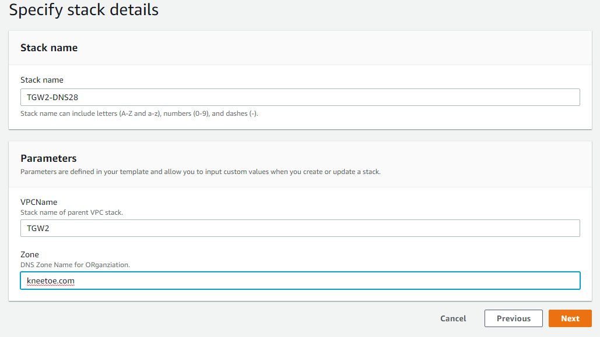

# 3. DNS between On-Prem and the Cloud

We want to be able to allow systems in our datacenter and our VPCs to use DNS to lookup addresses without having to manage DNS servers on EC2 instances.

## Datacenter to VPC DNS lookup flow diagram



## VPC to Datacenter DNS lookup flow diagram



## Build out DNS Infrastructure

Run CloudFormation template 3.tgw-dns.yaml to deploy the Bind server in the Datacenter as well as add AWS Route53 Resolver endpoints in the Datacenter Services VPC.

<details>
<summary>HOW TO Deploy the Bind Server</summary><p>

1. In the AWS Management Console change to the region you are working in. This is in the upper right-hand drop-down menu.

1. In the AWS Management Console choose **Services** then select **CloudFormation**.

1. In the main panel select **Create Stack** in the upper right hand corner.<p>

   

1. Make sure **Template is ready** is selected from Prepare template options.

1. At the **Prerequisite - Prepare template** screen, for **template source** select **Upload a template file** and click **Choose file** from **Upload a Template file**. from your local files select **3.tgw-dns.yaml** and click **Open**.

1. Back at the **Prerequisite - Prepare template** screen, clcik **Next** in the lower right.

1. For the **Specify stack details** give the stack a name, enter the name of your first stack (must be entered exactly to work), and select DNS compliant domain name, such as **kneetoe.com**. Click **Next**.
   

1. For **Configuration stack options** we don't need to change anything, so just click **Next** in the bottom right.

1. Scroll down to the bottom of the **Review name_of_your_stack** and check the **I acknowledge that AWS CloudFormation might create IAM resources with custom names.** Click the **Create** button in the lower right.
   

1. wait for the Stack to show **Create_Complete**.
   

      </p>
      </details>

<details>
<summary>HOW TO Verify DNS communication</summary><p>
1. In the AWS Management Console choose **Services** then select **Systems Manager**.

1. From the menu on the left, Scroll down and select **Session Manager**. Session Manager allows us to use IAM role and policies to determine who has console access without having to manage ssh keys for our instances.

1. In the main pane, click the **Start session** button. Pick The Datacenter Instance to shell into. You will now enter a bash shell prompt for that instance.

1. Let Ping np1.aws._your_domain_name_. Every one second or so, you should see a new line showing the reply and roundtrip time.


```

sh-4.2$ ping np1.aws.kneetoe.com
PING 10.16.18.220 (10.16.18.220) 56(84) bytes of data.
64 bytes from 10.16.18.220: icmp_seq=1 ttl=254 time=1.09 ms
64 bytes from 10.16.18.220: icmp_seq=2 ttl=254 time=0.763 ms
64 bytes from 10.16.18.220: icmp_seq=3 ttl=254 time=0.807 ms
64 bytes from 10.16.18.220: icmp_seq=4 ttl=254 time=0.891 ms
64 bytes from 10.16.18.220: icmp_seq=5 ttl=254 time=0.736 ms
64 bytes from 10.16.18.220: icmp_seq=6 ttl=254 time=0.673 ms
64 bytes from 10.16.18.220: icmp_seq=7 ttl=254 time=0.806 ms
^C
--- 10.16.18.220 ping statistics ---
7 packets transmitted, 7 received, 0% packet loss, time 6042ms
rtt min/avg/max/mdev = 0.673/0.824/1.096/0.130 ms
```

1. Since we dont allow pings the other way, lets test by using **Session Manager** to shell to NP1, and using dig to lookup a name provided by the Bind server in the Datacenter (test._your_domain_name_). It should return the private ip address of the Bind Server.


```
sh-4.2$ dig test.kneetoe.com

; <<>> DiG 9.9.4-RedHat-9.9.4-61.amzn2.0.1 <<>> test.kneetoe.com
;; global options: +cmd
;; Got answer:
;; ->>HEADER<<- opcode: QUERY, status: NOERROR, id: 59048
;; flags: qr rd ra; QUERY: 1, ANSWER: 1, AUTHORITY: 0, ADDITIONAL: 1

;; OPT PSEUDOSECTION:
; EDNS: version: 0, flags:; udp: 4096
;; QUESTION SECTION:
;test.kneetoe.com.                  IN      A

;; ANSWER SECTION:
test.kneetow.com.           60      IN      A       10.4.12.187

;; Query time: 5 msec
;; SERVER: 10.16.0.2#53(10.16.0.2)
;; WHEN: Fri Feb 01 16:33:27 UTC 2019
;; MSG SIZE  rcvd: 57
```

</p>
</details>

### Next Steps

You now have **completed** this section. Continue to the [Setup Multiaccount Communications module](../4.multiaccount) to connect in another AWS account to our Transit Gateway.
