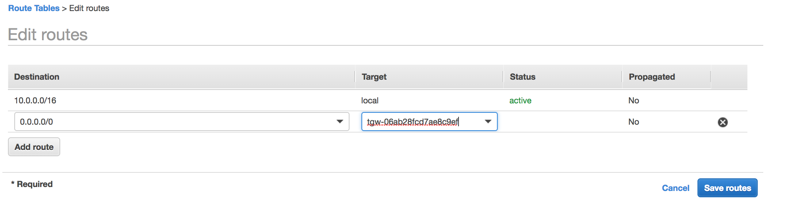

# 4. Multi-Account Sharing and Communications

Let's Extend this out a bit. Many organizations want to segment out their deployment at an account level. This works great for creating easy boundries for permissions, account limits, and general organizations.

AWS Resource Access Manager (RAM) is a service that enables you to easily and securely share AWS resources with any AWS account or within your AWS Organization. You can share AWS Transit Gateways, Subnets, AWS License Manager configurations, and Amazon Route 53 Resolver rules resources with RAM.
We are going to use three of those: our Transit Gateway, the two private subnets in Non-Prod VPC, and the Route53 Rule for looking up on-prem DNS names.

\*Note: in order to complete this section, we need another AWS account. and we need to perform these steps in the same Region as the Transit Gateway was built in using the previous section. This works well, pairing up with someone else also doing the labs, and connecting this new VPC to their Transit Gateway.


## Share the Transit Gateway for Cross-Account Access

The first scenario we want to walk through is sharing the Transit Gateway so that we can easily route between VPCs that are in other accounts but still in our organization. We can share outside of our organization too through invitations. In this case we are going to share with the organization.

<details>
<summary>HOW TO Share the Transit Gateway</summary><p>

1. In the AWS Management Console change to the region you plan to work in and change. This is in the upper right hand drop down menu.

1. Lets determine the scope of the share. If you are pairing up with someone, choose **Option 1** below, we will use their Account number. If you are working in your Organziation, you can also use **Option 2** and share with all of the account in your AWS organization.
   **OPTION 1**

   - Pair up with someone else completing this walkthrough and share your account number with them, and jot their account number down as well. You will use this when identifying **Principals** later.
     You will connect a new VPC to their Transit Gateway and they will connect a new VPC to your Accounts Transit Gateway

   **OPTION 2**

   - Just to the left of the Region Drop down, click on your login drop-down menu and select **My organization**. On **Your account belongs to the following organization:** screen, make a note of the **Organization ID** (it will start with an **o-**)

1. In the AWS Management Console choose **Services** then select **Resource Access Manager**.

1. From the left-hand menu select **Resource Shares** (you may have to open the Burger menu). Click the **Create a resource share** button in the upper right of the main panel.

1. Fill out the **Create Resource Share** details:

- **Name** - give it a Descriptive name for the Share
- **Seclect Resource type** - from the drop down select **Transit Gateways**.
- **ID** - from the list, select the Transit Gateway you created for the Lab
- **Principals - optional** - in the search box, paste the account number or organization ID you recorded a few steps up (depending on which option you picked above). Click the **add** button to the right.
  Verify you have everything entered correctly and click the **Create resource share** in the bottom right of the main panel.

</p>
</details>

## Create A new VPC for Non-Production

Run CloudFormation template 4.tgw-vpcs.yaml to deploy the VPC in the Same Region as the other accounts Transit Gateway was built in.

<details>
<summary>HOW TO Deploy the VPC</summary><p>

1. In the AWS Management Console change to the region the VPCs and Transit Gateway were created **IN THE OTHER ACCOUNT**. This is in the upper right-hand drop-down menu. _note: Today, AWS Transit Gateway can only attach to VPCs in the same region as the Transit Gateway. There are architectures that allow for a multi-region design, for example using VPN and a Transit VPC. This is out of scope for this lab._

1. In the AWS Management Console choose **Services** then select **CloudFormation**.

1. In the main panel select **Create Stack** in the upper right-hand corner.<p>

   

1. Make sure **Template is ready** is selected from Prepare template options.

1. At the **Create stack** screen, for **Template source** select **Upload a template file** and click **Choose file** from **Upload a Template file**. from your local files select **1.tgw-vpcs.yaml** and click **Open**.

1. Back at the **Create stack** screen, click **Next** in the lower right.

1. For the **Specify stack details** give the stack a name and Select two Availability Zones (AZs) to deploy to. _We will be deploying all of the VPCs in the same AZs, but that is not required by AWS Transit Gateway_. Click **Next**.
   

1. For **Configuration stack options** we don't need to change anything, so just click **Next** in the bottom right.

1. Scroll down to the bottom of the **Review name_of_your_stack** and check the **I acknowledge that AWS CloudFormation might create IAM resources with custom names.** Click the **Create** button in the lower right.
   

1. Wait for the Stack to show **Create_Complete**.
   

      </p>
      </details>

## Create a Transit Gateway Attachment to the Shared Transit Gateway

In the earlier deployment of our Transit Gateway, we allowed CloudFormation to deploy our Attachments to the VPCs. This time we will walk through the install manually.

<details>
<summary>HOW TO Attach VPC to Transit Gateway</summary><p>

1. In the AWS Management Console change to the region you are working in. This is in the upper right hand drop down menu.

1. In the AWS Management Console choose **Services** then select **VPC**.

1. From the menu on the left, Scroll down and select **Transit Gateway Attachments**.

1. You will see the VPC Attachments listed, but we want to add one to connect our Datacenter. Click the **Create Transit Gateway Attachment** button above the list.

1. Fill out the **Create Transit Gateway Attachment** form.

   - **Transit Gateway ID** select the TGW from the list that is from the other account.
   - **Attachment Type** is **VPC**
   - **Attachment name tag** give it a descriptive name.
   - **DNS support** leave enabled.
   - **IPv6 support** leave unchecked
   - **VPC ID** select the ID that has the name: NP3-_stack_name_ from the list
   - **Subnet IDs** check the two subnets that end in **Attach-A Subnet** and **Attach-B Subnet**.
     Verify you have everything entered correctly and click the **Create attachment** in the bottom right of the main panel.

1. Click **close**

1. Still on the **VPC** Service console, from the menu on the left Scroll up and select **Route Tables**

1. You will see the Route Tables listed in the main pane. Select NP3-_stack_name_-Private route table, Check the box next to it. Let's take a look toward the bottom of the panel and click the **Routes** tab. Currently, there is just one route, the local VPC route. Since the only way out is going to be the Transit Gateway, lets make our life simple and point a default route to the Transit Gateway Attachment. Click the **Edit Routes** in the **Routes** tab.

1. On the **Edit routes** page, Click the **Add route** button and enter a default route by setting the destination of **0.0.0.0/0**. In the Target drop-down, select **Transit Gateway** and pick your Transit Gateway create for this project. Make sure its the one in the other account, not the account you are currently logged into.
   

   ### Now we need to manage the routing in Transit Gateway account.

1. From the Menu on the Left Select **Transit Gateway Attachments** to give the VCP attachment a name. Scan down the **Resource type** column for the Attachment with the **Name** blank. You can verify this Attachment is from the other Account by looking at the **Details** tab at the bottom of the main panel. The **Resource owner account ID** will be the other AWS account ID. \*note: Back at the top, if you click the pencil that appears when you mouse over the **Name** column, you can enter a name that is different than the first VPN. Be sure to click the _check_ mark to save the name.

1. From the Menu on the Left Select **Transit Gateway Route Tables**. From the table in the main panel select **Red Route Table**. Lets take a look toward the bottom, and click the **Associations** tab. Associations mean that traffic coming from the outside toward the Transit gateway will use this route table to know where the packet will go after routing through the TGW. _note: An attachment can only be Associated with one route table. But a route table can have multiple associations_. Here in the **Red Route Table**, click **Create associations** in the **Associations** tab. From the drop-down list, select the NP3 vpc . _note:it should be the only one in the list without a **Association route table** ._ Click **Create association**.
   

1. While at the **Transit Gateway Route Tables**, take a look at the **Propagations** tab. These are the Resources that dynamically inform the route table. An attachment can propagate to multiple route tables. For the New Non-Production (NP3) VPC, we want to propagate to the Non-Prod(Red) route table and the Datacenter/Datacenter Services ROute table (Green) route table. Lets start with the **Red Route Table**. We can see all of the VPCs are propagating their CIDR to the route table.

1. Repeat the above step on the propagations tab for the **Green Route Table**.

</p>
</details>

## Share a VPC

Attaching VPCs in other Accounts is super useful and has its place. But many times, we dont need things to be in separate networks, we just need to separate out who can manage the resources we put in the network. Customer's in the past often created this isolation by using Resource Tags, IAM polices, and IAM roles. Many times, creating a new account and VPC just for this separation. Now with Resource Access Manager and the ability to share Subnets in a VPC, multiple accounts can place resources into the same VPC. Each account having the ability to define its own account limits, security policy, and IAM roles. It also makes the for a cleaner and easier to use network. To be clear, having multiple VPCs still has its place such as isolating security tiers limiting audit scope, etc.) Lets take a look.

<details>
<summary>Share Subnets in a VPC with other Accounts</summary></p>

1. In the AWS Management Console change to the region you plan to work in and change. This is in the upper right-hand drop-down menu.

1. Lets determine the scope of the share. If you are pairing up with someone, choose **Option 1** below, we will use their Account number. If you are working in your Organization, you can also use **Option 2** and share with all of the account in your AWS organization.
   **OPTION 1**

   - Pair up with someone else completing this walkthrough and share your account number with them, and jot their account number down as well. You will use this when identifying **Principals** later.
     You will deploy and EC2 instance in the other accounts NP-2 VPC and from their ping the server in NP1 VPC.

   **OPTION 2**

   - Just to the left of the Region Drop down, click on your login drop-down menu and select **My Organization**. On **Your account belongs to the following organization:** screen, make a note of the **Organization ID** (it will start with an **o-**)

1. In the AWS Management Console choose **Services** then select **Resource Access Manager**.

1. From the left-hand menu select **Resource Shares** (you may have to open the Burger menu). Click the **Create a resource share** button in the upper right of the main panel.

1. Fill out the **Create Resource Share** details:

   - **Name** - give it a Descriptive name for the Share
   - **Select Resource type** - from the drop down select **Subnets**.
   - **ID** - from the list, select the two private subnets in NP2 VPC (their **Names** are NP2-_vpc_stack_name_-Priv-A and NP2-_vpc_stack_name_-Priv-B)
   - **Principals - optional** - in the search box, paste the account number or organization ID you recorded a few steps up (depending on which option you picked above). Click the **add** button to the right.
     Verify you have everything entered correctly and click the **Create resource share** in the bottom right of the main panel.

</p>
</details>

## Place an EC2 instance in another AWS account's VPC

We will spin up an EC2 instance in the other Accounts NP2 VPC and test ping their NP1 Server.

<details>
<summary>Launch an EC2 Instance in NP2 VPC</summary></p>
*INCOMPLETE*
1. Launch EC2 instance in the Shared VPC subnet.
2. Use Session manager to access the new server's shell
3. ping np1.aws.*corp_domain_name
      ```
      sh-4.2$ ping np1.aws.kneetoe.com
      PING 10.16.18.220 (10.16.18.220) 56(84) bytes of data.
      64 bytes from 10.16.18.220: icmp_seq=1 ttl=254 time=1.09 ms
      64 bytes from 10.16.18.220: icmp_seq=2 ttl=254 time=0.763 ms
      64 bytes from 10.16.18.220: icmp_seq=3 ttl=254 time=0.807 ms
      64 bytes from 10.16.18.220: icmp_seq=4 ttl=254 time=0.891 ms
      64 bytes from 10.16.18.220: icmp_seq=5 ttl=254 time=0.736 ms
      64 bytes from 10.16.18.220: icmp_seq=6 ttl=254 time=0.673 ms
      64 bytes from 10.16.18.220: icmp_seq=7 ttl=254 time=0.806 ms
      ^C
      --- 10.16.18.220 ping statistics ---
      7 packets transmitted, 7 received, 0% packet loss, time 6042ms
      rtt min/avg/max/mdev = 0.673/0.824/1.096/0.130 ms
      ```
</p>
</details>

# Congratulations

## You now have **completed** this Workshop. Return to the Overview to read how to [clean up the accounts](../).
