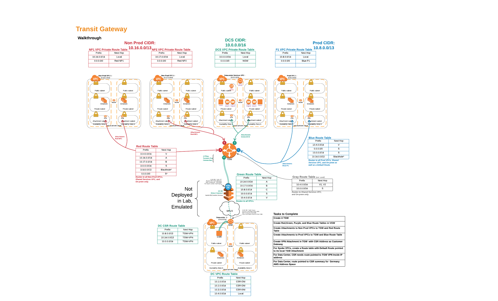

# Transit Gateway, a walkthrough

This walkthrough shows how to setup Transit Gateway with multiple VPC and Routing domains as well as connect the Transit Gateway to the Datacenter via VPN.



1. Run Cloudformation template 1.tgw-vpcs.yaml
2. Run Cloudformation template 2.tgw-csr.yaml. Be sure to use the stack name used in step one for the 'Parent Stack'.
3. Create TGW attachment for VPN.

- use 169.254.10.0/30 and 169.254.11.0/30 for CIDR.
- use awsamazon for custom settings

4. using the two VPN tunnel endpoint address generated from step 3, run the bash script, createcsr.sh. Be sure to check the console VPC Service. Under Site-to-Site VPN tunnel detail find the addresses. Be sure to put the address that lines up with Inside IP CIDR address 169.254.10.0/30 for ip1.

```
./createcsr.sh ip1 ip2 outputfile
./createcsr.sh 1.1.1.1 2.2.2.2 mycsrconfig.txt
```

5. ssh to the CSR (Cloudformation output privdes a sample ssh command. be sure to verify your key and key path)
6. enter configuration mode

```
config t
```

7. paste in the text from the outputfile created in step 4.
8. Launch a Bind DNS server into the Datacenter (DC1 VPC) using the cloudformation template 3.tgw-dns.yaml

# To Do:

1. add AWS Resolver from geseib/awsresolver to this environment with Bind server in Datacenter Services VPC which connects to on Prem Bind Server.
2. add External routing through NAT Gateway/IGW in Datacenter services.
3. add Second prod VPC from another account instructions
4. add Shared VPC subnets in the non-prod VPC and give access from the account used in step 3.
5. add a AD in on prem DC connected to AD in Datacenter Services and SSO
