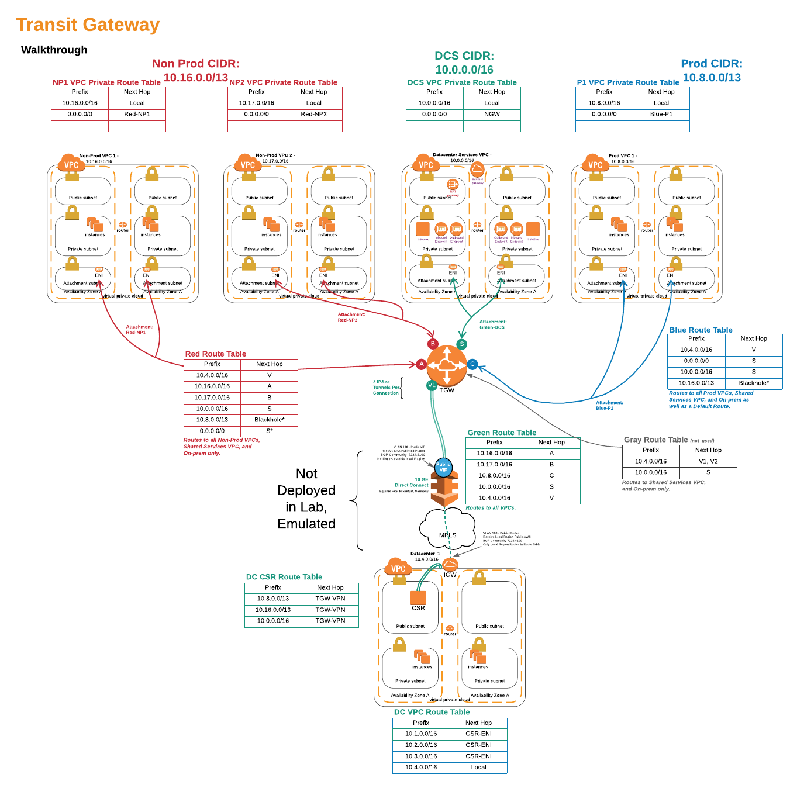
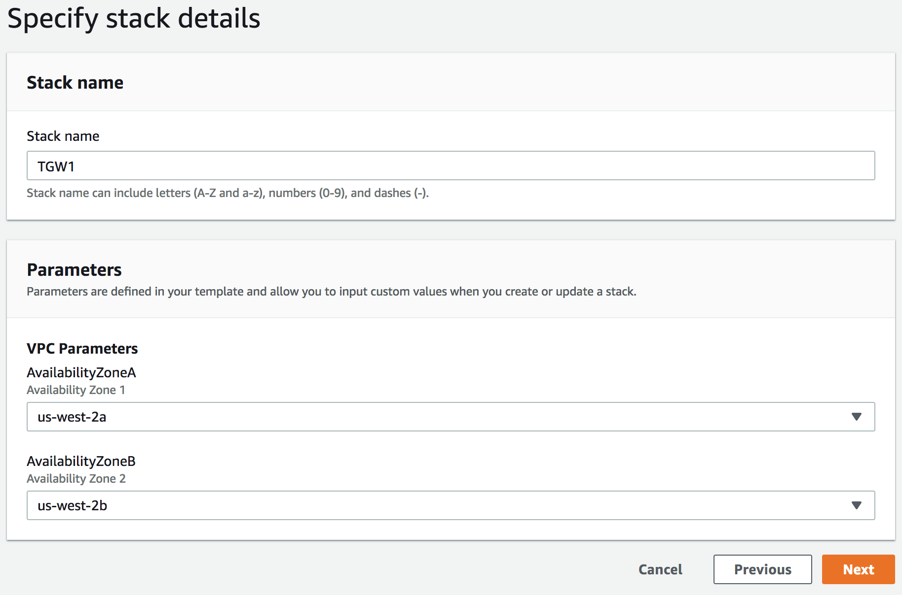
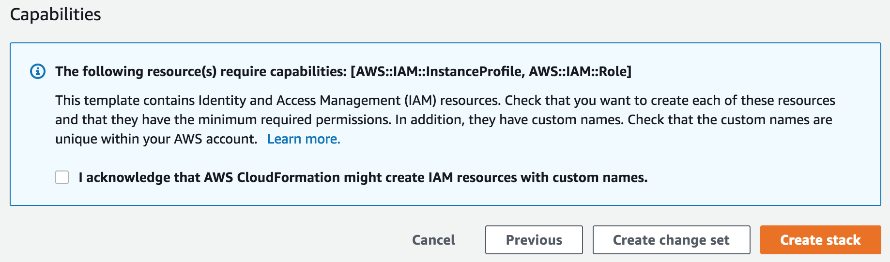
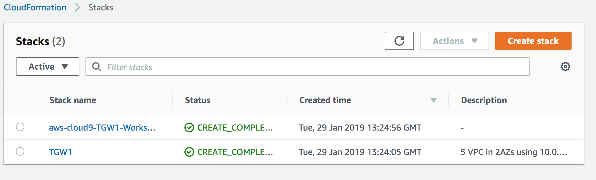
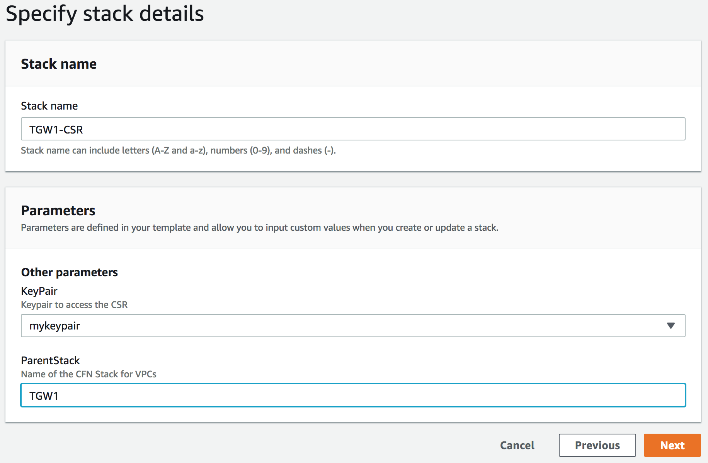
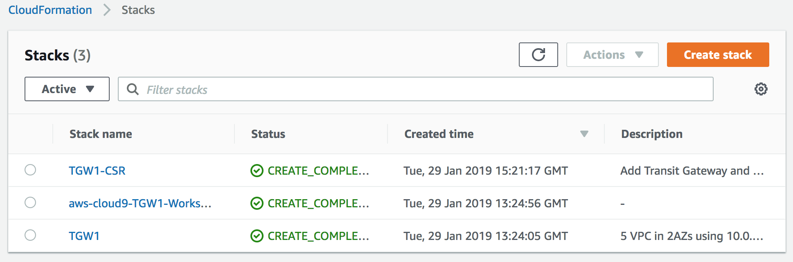
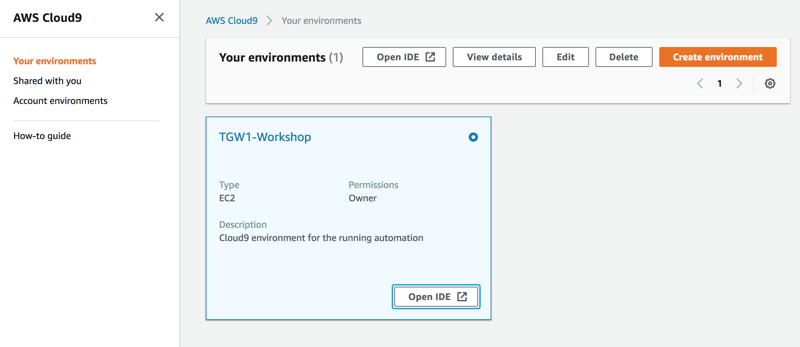
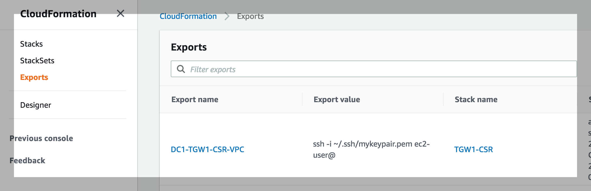
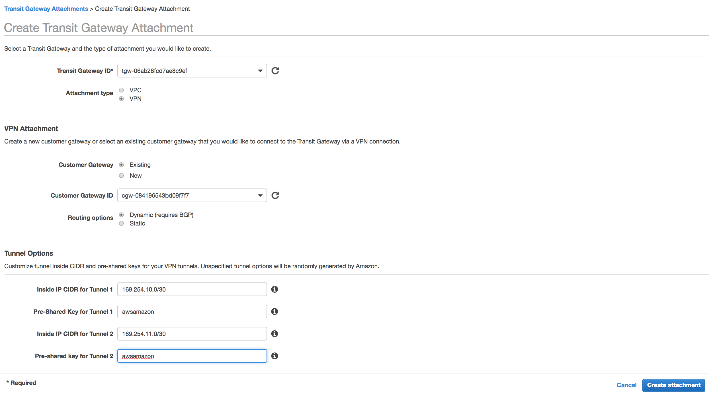
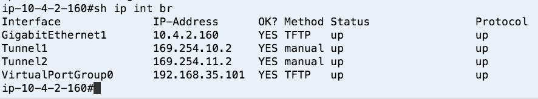

# Transit Gateway, a walkthrough

This walkthrough shows how to setup Transit Gateway with multiple VPC and Routing domains as well as connect the Transit Gateway to the Datacenter via VPN.



## Introduction

When building a multi-VPC and/or multi-account architecture there are several services that we need to consider to provide seamless integration between our AWS environment and the existing infrastrucutre in our datacenter.
Foundationally, we need to provide robust connectivity and routing between the datacenter and all of the VPCs. But we also need to provide and control routing between those VPC. For example we may have a 'Shared Services' VPC that every other VPC needs access to where we place common resources that everyone needs, such as a NAT Gateway Service to access the internet. At the same time, we dont want just any VPC talking to any other VPC. In this case, we don't want our 'Non-Production' VPCs talking to our 'Production' VPCs.

In the past, customers used thrid-party solutions and/or transit VPCs that they build and managed. In order to remove much of that undifferentiated heavy lifting, we will use **AWS Transit Gateway** Service to provide this connectivty and routing. **AWS Transit Gateway** is a service that enables custoemrs to connect their Amazon Virtual Private Clouds(VPCs) and their on-premise networks to a single highly-available gateway. **AWS Transit Gateway** provides easier connectivity, better visibility, more control, and on-demand bandwidth.

After we have connectivity and routing, we need to provide seamless DNS resolution between our Datacenter the VPCs. Our on-prem devices will want to reach out to our resources in the cloud using DNS names, not IP addresses and the resources in the cloud will want to do the same for servers back in our datacenter. Avoiding hard-coding IP addresses in our applications is best practice. To do this we will use **Amazon Route53 Resolver**. **Amazon Route53 Resolver** for hybrid clouds allows us to create highly-available endpoints in our VPCs to integrate with the Amazon Provided DNS (sometmes referred to as the .2 resolver, since it is always 2 addresses up from the VPC CIDR block. i.e. 172.16.0.2 for VPC CIDR 172.16.0.0/24)

## Planning

### VPC layout

There are lots of choices for VPC and Account Architectures, and this is mostly out-of-scope for this workshop. Take a look at what Androski Spicer presented at re:invent 2018 in his [From One to Many: Evolving VPC Design](https://www.youtube.com/watch?v=8K7GZFff_V0 "youtube video") session.
In our case, we are going to provide three types of VPCs:

1. **Non-production VPCs**: We might create several of these to house our training environments, development, and QA resources.
1. **Prodcution VPCs**: This is for our live production systems.
1. **Shared Resources**: For resources and services that we want shared across all VPCs.
1. **Datacenter**: In this workshop we need to simulate a datacenter. In the real world, this would be our existing datacenter or colo and the hardware it contains. But we are going to make our own version in the cloud!

### IP addressing

Carving up and assigning private IP address(RFC 1918 addresses) space is big subject and can be daunting of you have a large enterprise today, espeically with mergers. Even when you have a centralized IP address management system (IPAM), you will find undocumented address space being used and sometimes finding useable space is difficult. However we want to find large non-fragmented spaces so we can create a well-summerized network. Don't laugh, we all like a challenge, right?
In our case we found that the 10.0.0.0/11 space was available (I know fiction, right?). So, we are going to carve up /13's for our production and non-production and we will grab a /16's for our shared service and a /16 for our simulated datacenter.
What does that mean?

1. Non-Production CIDR: 10.16.0.0/13 is 10.16.0.0 - 10.23.255.255. which we can carve into eight /16 subnets, one for each of our VPCs.
1. Production CIDR: 10.8.0.0/13 is 10.8.0.0 - 10.15.255.255. which we can also carve into eight /16 subnets.
1. Shared Service CIDR: 10.0.0.0/16 - 10.0.0.0 - 10.0.255.255. which we will use for 1 Datacenter Services VPC.
1. Simulated Datacenter CIDR: 10.4.0.0/16 - 10.4.0.0 - 10.4.255.255. which will be our Datacenter VPC.

### Connectivity

For connectivity between VPCs, AWS Transit Gateway make life easy. We

## Getting Started

First, we need to get our infrastructure in place. The following Cloudformation Template will build out _five_ VPCs. In ourder to do that we will first remove the default VPC. \*note: if you ever remove you default VPC in your own account, you can recreate it via the console or the CLI see the [documentation](https://docs.aws.amazon.com/vpc/latest/userguide/default-vpc.html#create-default-vpc "AWS Default VPC Documentation").

### Pick Region

Since we will be deploying Cloud9 into our Datacenter VPC, we need to pick one of the following Regions:

- N. Virginia (us-east-1)
- Ohio (us-east-2)
- Oregon (us-west-2)
- Ireland (eu-west-1)
- Singapore (ap-southeast-1)

### 1. Delete Default VPC

<details>
<summary>HOW TO Delete Default VPC</summary><p>

1. In the AWS Management Console change to the region you plan to work in and change. This is in the upper right hand drop down menu.

1. In the AWS Management Console choose **Services** then select **VPC**.

1. From the left-hand menu select **Your VPCs**.

1. In the main panel, the checkbox next to only VPC (the default VPC) should be highlighted. You can verify this is the Default VPC by scrolling to the right. The _Default VPC_ column will be maked with **Yes**.

1. With our Default VPC checked select the **Actions** dropdown above it and select **Delete VPC**.

1. In the _Delete VPC_ Panel, check the box 'I Acknowledge that I want to delete my default VPC.' and click the **Delete VPC** button in the bottomm right.

1. You should gett a green highlighted Dialog stating 'The VPC was deleted' and you can click **Close**. _If it is Red, then likely something is deployed into this VPC and you will have to remove those resources (could be EC2 instances, NAT Gateway, VPC endpoints, etc)_.

</p>
</details>

### 2. Deploy Our Five VPCs

Run Cloudformation template 1.tgw-vpcs.yaml to deploy the VPCs.

<details>
<summary>HOW TO Deploy the VPCs</summary><p>

1. In the AWS Management Console change to the region you are working in. This is in the upper right hand drop down menu.

1. In the AWS Management Console choose **Services** then select **Cloudformation**.

1. In the main panel select **Create Stack** in the upper right hand corner.<p>
   

1. Make sure **Template is ready** is selected from Prepare teplate options.

1. At the **Prerequisite - Prepare template** screen, for **template source** select **Upload a template file** and click **Choose file** from **Upload a Template file**. from your local files select **1.tgw-vpcs.yaml** and click **Open**.

1. Back at the **Prerequisite - Prepare template** screen, clcik **Next** in the lower right.

1. For the **Specify stack details** give the stack a name (be sure to record this, as you will need it later) and Select two Availability Zones (AZs) to deploy to. \*We will be deploying all of the VPCs in the same AZs, but that is not required. Click **Next**.
   

1. For **Configuration stack options** we dont need to change anything, so just click **Next** in the bottom right.

1. Scroll down to the bottom of the **Review name_of_youstack** and check the **I acknowledge the AWS CloudFormation might create IAM resourcfes with custom names.** Click the **Create** button in the lower right.
   

1. wait for the Stack to show **Create_Complete**.
   

      </p>
      </details>

      <details>
   <summary>Investigate the VPCs</summary><p>

- Add steps to take a look at the Subnets, route tables, etc.
- Add steps for using session manager to access an EC2 instance. Talk about no Bastion etc.

</p>
</details>

### 3. Create Transit Gateway and Datacenter Router

We now are ready to start our connectivity and routing policy.
Run Cloudformation template 2.tgw-csr.yaml to deploy the Transit Gateway, route Tables, and the Datacenter Router (Cisco CSR).

<details>
<summary>HOW TO Deploy the Transit Gateway and Datacenter Router</summary><p>

1. In the AWS Management Console change to the region you are working in. This is in the upper right hand drop down menu.

1. In the AWS Management Console choose **Services** then select **EC2**.

1. From the left-hand menu select **Key Pairs**.

1. Click **Create Key Pair** in the main panel and give your new key a name. Click **Create**.

1. Save the keypair to your local machine for easy access later. \*note: We will need this key to access the Cisco CSR router that is in our Simulated Datacenter VPC\*\*.

1. In the AWS Management Console choose **Services** then select **Cloudformation**.

1. In the main panel select **Create Stack** in the upper right hand corner.<p>
   

1. Make sure **Template is ready** is selected from Prepare template options.

1. At the **Prerequisite - Prepare template** screen, for **template source** select **Upload a template file** and click **Choose file** from **Upload a Template file**. from your local files select **2.tgw-csr.yaml** and click **Open**.

1. Back at the **Prerequisite - Prepare template** screen, clcik **Next** in the lower right.

1. For the **Specify stack details** give the stack a name (compounded names work well. i.e. if the VPC stack abouve was named **TGW1** name this stack **TGW1-CSR**). and Select two Availability Zones (AZs) to deploy to. \*We will be deploying all of the VPCs in the same AZs, but that is not required. Click **Next**.
   

1. For **Configuration stack options** we dont need to change anything, so just click **Next** in the bottom right.

1. Scroll down to the bottom of the **Review name_of_youstack** and check the **I acknowledge the AWS CloudFormation might create IAM resourcfes with custom names.** Click the **Create** button in the lower right.
   

1. wait for the Stack to show **Create_Complete**.
   

   </p>
   </details>

<summary>Create Routes in the VPC to the Transit Gateway Attachments</summary><p>
1. In the AWS Management Console change to the region you are working in. This is in the upper right hand drop down menu.

1. In the AWS Management Console choose **Services** then select **VPC**.

1. 

</p>
</details>

<details>
<summary>Access AWS Cloud9 Environment </summary><p>
- Add steps to take a look at the TGW, TGW route tables, TGW attachments.
- Add steps for accessing Cloud9.
1. In the AWS Management Console change to the region you are working in. This is in the upper right hand drop down menu.

1. In the AWS Management Console choose **Services** then select **Cloud9**.

1.From **Your Environments** page click the **Open IDE* button on the Workshop Environment Box.


1. This will bring up the Cloud9 Console and download the github repo to your working folder. 

1. From the **file** menu select **Upload Local Files...** and click **Select files** button, navigate to the key file you created earlier. *note: it should have a .pem extension*.


1. In the main pane click the + sign and launch a **New Terminal**. This is a bash shell on the Cloud9 Instance

1. move the key to the .ssh folder: mv *key_name*.pem ~/.ssh/.

1. secure the key file: chmod 400 ~/.ssh/*key_name*.pem

1.From another broswer tab, again navigate, Management Console choose **Services** then select **CloudFormation**.

1. From the EC2 Dashboard, select **Exports** in the left hand menu and find the export for ssh to the CSR: DC1-*stack-name*-CSR-VPC and copy the **Export value**


1. Back on the **Cloud9** Browser tab paste this into the bash shell. Answer **yes** to the **Are you sure you want to continue connectiong (yes/no)?

1. you now are connected to the Cisco CSR in the Datacenter VPC. We will be configuring the Cisco CSR.

1. Lets look at the Interfaces by typing a the #prompt: **show ip interface brief** or **sh ip int br** for short. You will see the GigabitEhternet1 which is the interface our ipsec tunnel were traverse.

1. Take a look at the route table on the CSR by typeing at the #prompt: **sh ip route**. You will see S* 0.0.0.0/0 which is a static default route pointing to the 10.4.0.1 address. This is the local VPC router which will connect the Interface to the Internet Gateway and use an Elastic IP address (its the IP address you used in the SSH command above). This is a one-to-one mapping.

1. 

</p>
</details>
<details>
<summary>Setup VPN Between Datacenter and Transit Gateway</summary><p>
Ipsec tunnels can be setup over the internet or over Direct Connect (using a Public Virtual Interface). In this case we are connecting over the public backbone of AWS.
We will create two VPN tunnels from the Transit Gateway and connect them into a single instance of the Cisco CSR in the Datacenter. 
In a real production environment we would setup a second router for redundancy and for added bandwith setup multiple tunnels from each Cisco CSR (or whichever ipsec device you use). Each ipsec tunnel provides up to 1.25Gbps. This is called Equal cost multipath routing. On the AWS side, up to 50 parallel paths are supported. Many vendors support 4-8 ECMP paths, so check with your vendor)

1. In the AWS Management Console change to the region you are working in. This is in the upper right hand drop down menu.

1. In the AWS Management Console choose **Services** then select **VPC**.

1. From the menu on the left, Scroll down and select **Transit Gateway Attachments**.

1. You will see the VPC Attachments listed, but we want to add one to connect our Datacenter. Click the **Create Transit Gateway Attachment** button above the list.

1. Fill out the **Create Transit Gateway Attachment** form. 
  - **Transit Gateway ID** will have a name Tag matching your first Cloudformation Stack name.
  - **Attachment Type** is **VPN**
  - **Customer Gateway** (CGW) will be **Exisiting. *note: the Cloudformation template created the CGW. it is the IP address of our Datacenter VPN device and in the lab matches the IP of the SSH command above. 
  - Leave **Routing options** set to **Dynamic(requires BGP)**. *note: BGP is required if you want traffic to balance across more than one VPN tunnel at a time (ECMP or Equal Cost Multipathing)*
  - For **Inside IP CIDR for Tunnel 1** use **169.254.10.0/30** and **169.254.11.0/30** for CIDR.
  
  - For **Pre-Shared Key for Tunnel 1** use **awsamazon**
  - For **Inside IP CIDR for Tunnel 2** use **169.254.10.0/30** and **169.254.11.0/30** for CIDR.
  - For **Pre-Shared Key for Tunnel 2** use **awsamazon**
  Click **Create attachment**
  

1. From the Menu on the Left Select **Site-to-Site VPN Connections**. From the main pane you will see the VPN is in State **pending**. That fine lets take a look toward the bottom, and click the **Tunnel Details** tab. Record the two **Outside IP Address**es. We want to record them in the order of the one pairing up with the **Inside IP CIDR** range 169.254.**10**.0/30 first. 

1. While we are on the **Site-to-Site VPN Connections** page, lets go back to the top and give the VPN connection a name. If you click the pencil that appear when you mouse over the **Name** column, you can enter a name. Be sure to click the *check* mark to save the name. **THIS IS NOT SHOWING UP IN THE ASSOCIATIONS

1. From the Menu on the Left Select **Transit Gateway Route Tables**. From the table in the main pane select **Green Route Table**. Lets take a look toward the bottom, and click the **Associations** tab. Associations mean that traffic coming from the outside toward the Transit gateway will use this route table to know where the packet will go after routing through the TGW. *note: An attachment can only be Associated with one route table. But a route table can have multiple associations*. Here in the **Green Route Table**, We already have one association, The **Datacenter Services VPC**. Click **Create associations** in the **Associations** tab. From the drop-down list, select the vpn. *note:it should be the only one in the list without a **Association route table** .* Click **Create assocation**.

1. While at the **Transit Gateway Route Tables**, take a look at the **Propagations** tab. These are the Resources that Dynamically inform the route table. An attachment can propigate to multiple route tables. In this case, we want to propagate with all of the route tables, but lets start with the **Green Route Table**. We can see all of the VPCs are propagating their CIDR to the route table. Since the **Datacenter Services VPC** is also associated with this route table, we need to propagate the VPN routes to the **Green Route Table**

1. Repeat the above step for the **Red Route Table** and the **Blue Route Table**

1. Take a look at each of the route tables and notice the tab **Routes**. You can see the routes that are propagated, as well as a static route table that was created for you by the Cloudformation template. That's the default route (0.0.0.0/0) that will direct traffic destined for the internet to the **Datacenter Services VPC** and ultimately through the NAT Gateway in that VPC. *note: there is also a route table with no name. It is the dafult route table. In this lab we do not intend to use the default route table.

1. Back on the Cloud9 browser tab, using the two VPN tunnel endpoint address generated from the step above, cd to tgwwalk on the Cloud9 bash console and run the bash script, ./createcsr.sh. *note: Be sure to put the address that lines up with Inside IP CIDR address 169.254.10.0/30 for ip1*.

```
cd tgwwalk
##./createcsr.sh ip1 ip2 outputfile
./createcsr.sh 1.1.1.1 2.2.2.2 mycsrconfig.txt
```

1. On the left hand pane, the output file should be listed 
1. enter configuration mode

```
config t
```

1. Once in Configuration mode *note: you should see (config)# prompt*, paste in the text from the outputfile created in step 4. This will slowly paste in the configuration file. 

1. if you are still at the (config)# or (config-router) prompt, type **end** and press enter. 

1. Now lets look at the new interfaces: **sh ip int br**. You should see new interfaces: Tunnel1 and Tunnel2 and they both should show up. *note: if they do not chnage from down to up after a 2 minutes, likely casue is the ip addresses were flipped in the createcsr script. 


1. Lets make sure we are seeing the routes on the Cisco CSR. first we can look at what BGP is seeing: **show ip bgp summary**. The most important thing to see is the State/PfxRcd (Prefixes received). If this is in Active or Idle (likely if neigbor statement is wrong: IP address, AS number) there is a configuration issue. What we want to see is a number. In fact if everything is setup correctly we should see 4 for each neighbor.

</p>
</details>

1. Launch a Bind DNS server into the Datacenter (DC1 VPC) using the cloudformation template 3.tgw-dns.yaml

# To Do:

1. add AWS Resolver from geseib/awsresolver to this environment with Bind server in Datacenter Services VPC which connects to on Prem Bind Server.
2. add External routing through NAT Gateway/IGW in Datacenter services.
3. add Second prod VPC from another account instructions
4. add Shared VPC subnets in the non-prod VPC and give access from the account used in step 3.
5. add a AD in on prem DC connected to AD in Datacenter Services and SSO
