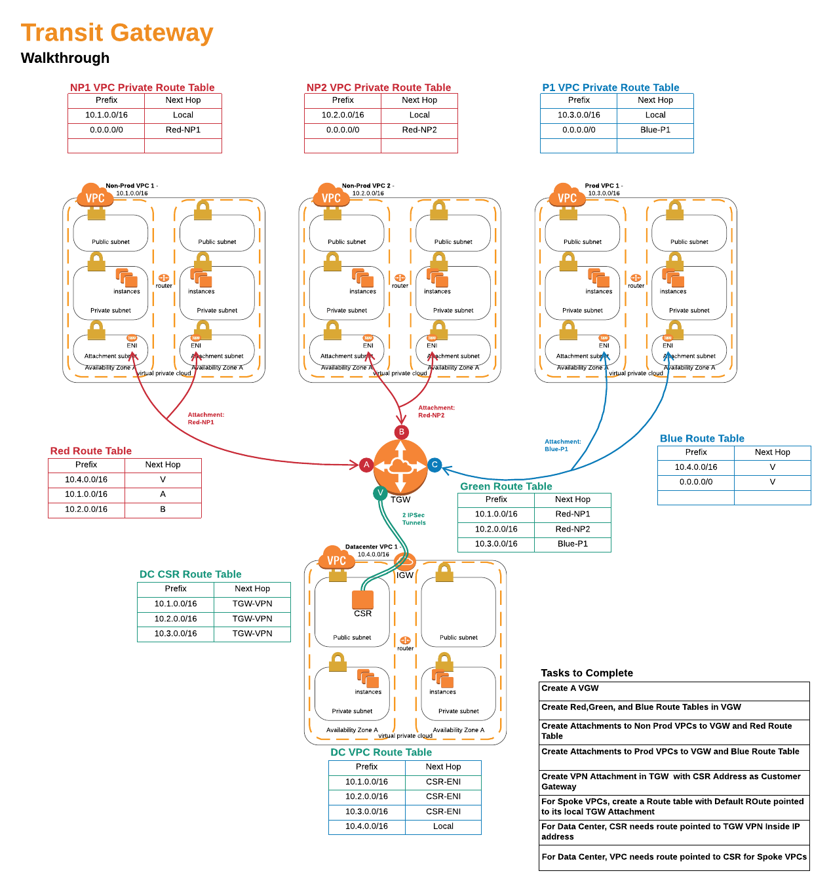

# Transit Gateway, a walkthrough

This walkthrough shows how to setup Transit Gateway with multiple VPC and Routing domains as well as connect the Transit Gateway to the Datacenter via VPN.

1. Run Cloudformation template tgw-vpcs-3.yaml
2. Run Cloudformation template tgw-csr.yaml. Be sure to use the stack name used in step one for the 'Parent Stack'.
