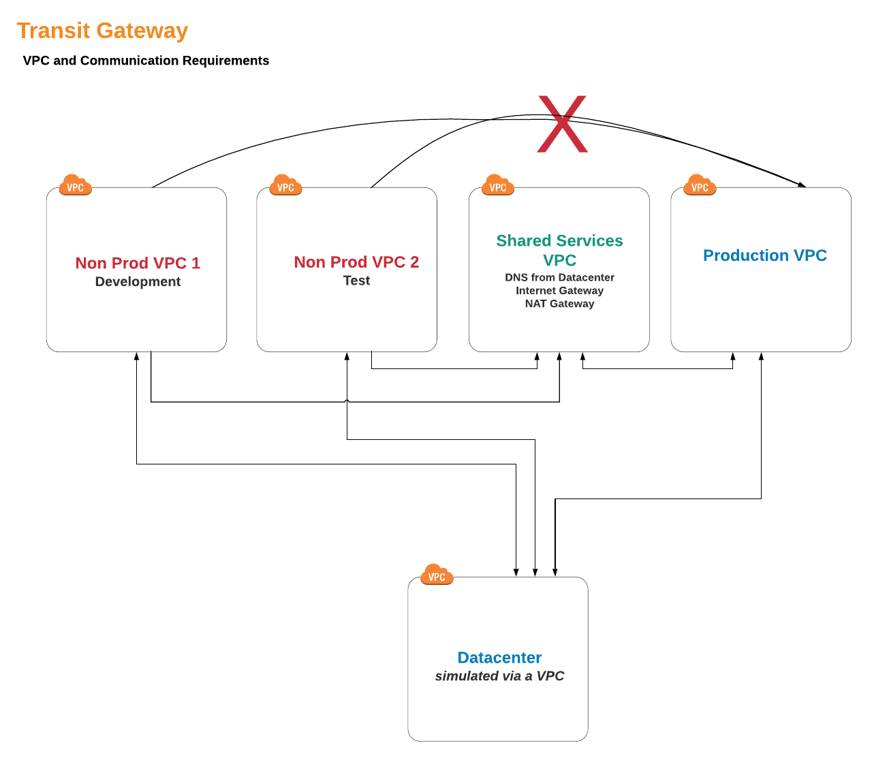
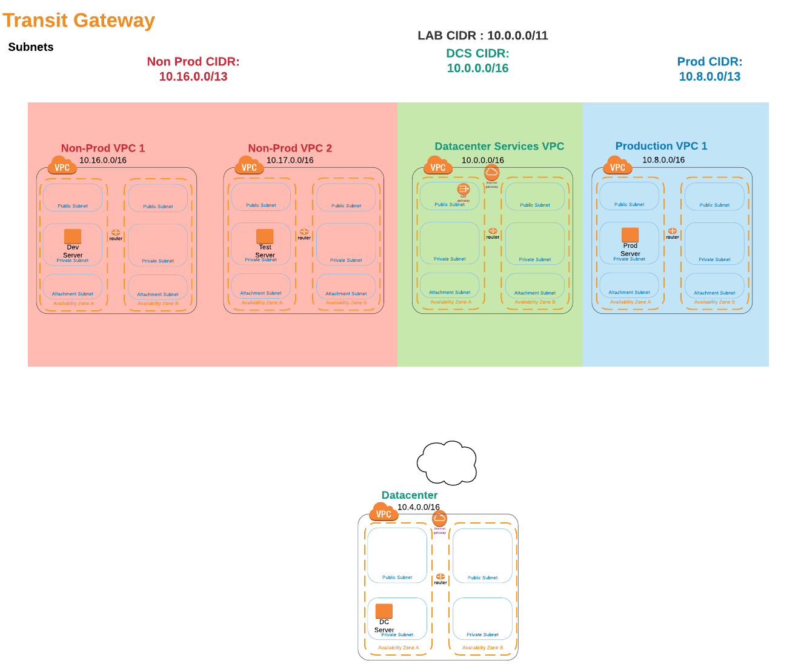

# Transit Gateway, a walkthrough

This workshop shows how to setup communication between multiple VPCs and On-premise resources in our Datacenter. We will explore how we can have different routing policies for different environments such as Non-production and production.

Next, we will make sure that we can easily communicate using DNS names vs IP addresses, without having to deploy and manage Virtual DNS servers on EC2. Finally, we will explore how resources in Multiple AWS accounts can communicate.

## AWS Services Explored

- **Amazon Virtual Private Cloud (VPC)** - logically isolated section of the AWS Cloud.
- **AWS Transit Gateway** - connectivity and routing between VPCs and Datacenter.
- **AWS Site-to-Site VPN** - (connection our datacenter to our VPCs).
- **Amazon Route 53 Resolver** - DNS integration between AWS and on-prem (Datacenter).
- **AWS Cloud9** - cloud Development environment we will use to edit files and access the Datacenter VPN Virtual Device.
- **AWS Systems Manager, Session Manager** - secure server shell access without SSH keys to manager
- **AWS CloudFormation** - a common language to model your entire infrastructure in a text file..
- **AWS Privatelink** - provides private connectivity between VPCs and AWS services.

## Introduction

When building a multi-VPC and/or multi-account architecture there are several services that we need to consider to provide seamless integration between our AWS environment and the existing infrastrucutre in our datacenter.
Foundationally, we need to provide robust connectivity and routing between the datacenter and all of the VPCs. But we also need to provide and control routing between those VPC. For example we may have a 'Shared Services' VPC that every other VPC needs access to where we place common resources that everyone needs, such as a NAT Gateway Service to access the internet. At the same time, we dont want just any VPC talking to any other VPC. In this case, we don't want our 'Non-Production' VPCs talking to our 'Production' VPCs.

In the past, customers used third-party solutions and/or transit VPCs that they build and managed. In order to remove much of that undifferentiated heavy lifting, we will use **AWS Transit Gateway** Service to provide this connectivty and routing. **AWS Transit Gateway** is a service that enables customers to connect their Amazon Virtual Private Clouds(VPCs) and their on-premise networks to a highly-available gateway. **AWS Transit Gateway** provides easier connectivity, better visibility, more control, and on-demand bandwidth.

After we have connectivity and routing, we need to provide seamless DNS resolution between our Datacenter the VPCs. Our on-prem devices will want to reach out to our resources in the cloud using DNS names, not IP addresses and the resources in the cloud will want to do the same for servers back in our datacenter. Avoiding hard-coding IP addresses in our applications is best practice. To do this we will use **Amazon Route53 Resolver**. **Amazon Route53 Resolver** for hybrid clouds allows us to create highly-available endpoints in our VPCs to integrate with the Amazon Provided DNS (sometmes referred to as the .2 resolver, since it is always 2 addresses up from the VPC CIDR block. i.e. 172.16.0.2 for VPC CIDR 172.16.0.0/24)

## Planning

### VPC layout

There are lots of choices for VPC and Account Architectures, and this is mostly out-of-scope for this workshop. Take a look at what Androski Spicer presented at re:invent 2018 in his [From One to Many: Evolving VPC Design](https://www.youtube.com/watch?v=8K7GZFff_V0 "youtube video") session.
In our case, we are going to provide three types of VPCs:

1. **Non-production VPCs**: We might create several of these to house our training environments, development, and QA resources.
1. **Prodcution VPCs**: This is for our live production systems.
1. **Shared Resources**: For resources and services that we want shared across all VPCs.

Also, we need a VPC to represent our on-premise environment, a simulated datacenter.

1. **Datacenter**: In this workshop we need to simulate a datacenter. In the real world, this would be our existing datacenter or colo and the hardware it contains. But we are going to make our own version in the cloud!

### IP addressing

Carving up and assigning private IP address(RFC 1918 addresses) space is big subject and can be daunting of you have a large enterprise today, especially with mergers. Even when you have a centralized IP address management system (IPAM), you will find undocumented address space being used and sometimes finding useable space is difficult. However we want to find large non-fragmented spaces so we can create a well-summarized network. Don't laugh, we all like a challenge, right?
In our case we found that the 10.0.0.0/11 space was available (I know, fiction, right?). So, we are going to carve up /13's for our production and non-production and we will grab a /16's for our shared service and a /16 for our simulated datacenter.
What does that mean?

1. **Non-Production CIDR: 10.16.0.0/13** is 10.16.0.0 - 10.23.255.255. which we can carve into eight /16 subnets, one for each of our VPCs.
1. **Production CIDR: 10.8.0.0/13** is 10.8.0.0 - 10.15.255.255. which we can also carve into eight /16 subnets.
1. **Shared Service CIDR: 10.0.0.0/16** - 10.0.0.0 - 10.0.255.255. which we will use for 1 Datacenter Services VPC.

\*\*We also will carve out a /16 CIDR for our Datacenter. In the real world this will likely be a list of many summarized CIDRs, both rfc 1918(private address space) and public IP CIDRs (addresses typically assigned to your organization from the Internet Assigned Numbers Authority (IANA) )

- **Simulated Datacenter CIDR: 10.4.0.0/16** - 10.4.0.0 - 10.4.255.255. which will be our Datacenter VPC.

### Connectivity

For connectivity between VPCs, AWS Transit Gateway make life easy. It will form the core of our VPC to VPC and VPC to Datacenter communication.

AWS Transit Gateway is a service that enables customers to connect their Amazon Virtual Private Clouds (VPCs) and their on-premises networks to a single gateway. As you grow the number of workloads running on AWS, you need to be able to scale your networks across multiple accounts and Amazon VPCs to keep up with the growth. Today, you can connect pairs of Amazon VPCs using peering. However, managing point-to-point connectivity across many Amazon VPCs, without the ability to centrally manage the connectivity policies, can be operationally costly and cumbersome. For on-premises connectivity, you need to attach your AWS VPN to each individual Amazon VPC. This solution can be time consuming to build and hard to manage when the number of VPCs grows into the hundreds.

**Key Definitions**

- **attachment** — You can attach a VPC or VPN connection to a transit gateway.

- **transit gateway route table** — A transit gateway has a default route table and can optionally have additional route tables. A route table includes dynamic and static routes that decide the next hop based on the destination IP address of the packet. The target of these routes could be a VPC or a VPN connection. By default, the VPCs and VPN connections that you attach to a transit gateway are associated with the default transit gateway route table.

- **associations** — Each attachment is associated with exactly one route table. Each route table can be associated with zero to many attachments.

- **route propagation** — A VPC or VPN connection can dynamically propagate routes to a transit gateway route table. With a VPC, you must create static routes to send traffic to the transit gateway. With a VPN connection, routes are propagated from the transit gateway to your on-premises router using Border Gateway Protocol (BGP).

# Modules

This workshop is broken up into multiple modules. You must complete each module before proceeding to the next. The first module has a slidedeck to understand the context, then second module explores the use of Amazon Comprehend, the next model helps you build a TensorFlow Model in Sagemaker, and in the last module we build the complete voice-of-the-customer application using a CloudFormation template.

## 1. [Setup the Environment](./1.setup) - 15 mins

## 2. [Connect a Single Account and Multiple VPCs to a Datacenter](2.singleaccount) - 60 mins

## 3. [Setup DNS communication between the Datacenter and the VPCs](3.dns) - 30 mins

## 4. [setup Multiaccount Communications](4.multiaccount) - 30 mins

## 5. Active Directory Integration(Coming soon)

## Removal

After you have completed the workshop, in order to keep charges to a minimum, always delete resources you no longer need.

1. Before deleting the CloudFormation templates, Delete the Site-to-Site VPN from the VPC services console.

1. Delete the CloudFormation templates in reverse order:
   - 4.tgw-vpc-cross.yaml
   - 3.tgw-dns.yaml
   - 2.tgw-csr.yaml (be sure you removed the Site-to-Site VPN form the VPC services first or it will fail to remove and you will have to do it again!)
   - 1.tgw-vpcs.yaml (this will also removed the cloud9 stack, no need to manual delete that stack)
